# NestFind: Principal Engineer Visual Review

> **Reviewer Posture**: This is a Pre-Launch Audit. Assume this system will be publicly deployed in 30 days.

---

## 1️⃣ SYSTEM ARCHITECTURE — VISUAL FIRST

```mermaid
flowchart TB
    subgraph "Trust Boundary: Public Internet"
        CLIENT_WEB["Next.js Web App<br/>(SSR + SPA)"]
        CLIENT_MOBILE["React Native<br/>(Expo)"]
    end

    subgraph "Trust Boundary: Backend Server"
        direction TB
        API["FastAPI Backend"]
        AUTH["JWT Auth Module<br/>⚠️ Hardcoded SECRET_KEY"]
        BGTASK["BackgroundTasks<br/>⚠️ In-Memory (Lossy)"]
    end

    subgraph "Trust Boundary: Persistence (Single Server)"
        SQLITE[("SQLite<br/>⚠️ Write Lock Bottleneck")]
        UPLOADS["Local Filesystem<br/>/backend/uploads/<br/>⚠️ Non-Persistent"]
    end

    subgraph "External Services"
        OLLAMA["Ollama (Local AI)<br/>Description Gen, Price Est"]
        SMTP["SMTP (Simulated)"]
    end

    CLIENT_WEB -- "HTTPS (REST)" --> API
    CLIENT_MOBILE -- "HTTPS (REST)" --> API
    API -- "JWT Validate" --> AUTH
    API -- "Async (In-Process)" --> BGTASK
    BGTASK -- "Send Email" --> SMTP
    API -- "SQLAlchemy ORM" --> SQLITE
    API -- "File I/O" --> UPLOADS
    API -- "HTTP" --> OLLAMA

    classDef danger fill:#f97316,stroke:#000,color:#fff
    class AUTH,BGTASK,SQLITE,UPLOADS danger
```

### Diagram Explanation

- **Trust Boundary 1 (Public)**: Web & Mobile clients communicate over HTTPS. **Client data (especially GPS) is NOT trustworthy.**
- **Trust Boundary 2 (Backend)**: All business logic lives here. The `SECRET_KEY` is hardcoded, meaning anyone with access to the repo (GitHub public) can forge tokens.
- **Trust Boundary 3 (Persistence)**: SQLite and local file storage are ephemeral. A server restart/migration loses all uploaded documents.
- **Failure Points (Orange)**:
    - `AUTH`: JWT secret is public.
    - `BGTASK`: Emails are lost on crash.
    - `SQLITE`: Concurrent writes fail.
    - `UPLOADS`: Files are not backed up.

---

## 2️⃣ DATA & STATE DESIGN

### a) Entity Relationship Diagram

### b) State Machine: Booking Lifecycle

```mermaid
stateDiagram-v2
    [*] --> PENDING : Buyer Creates
    PENDING --> APPROVED : Agent Approves (with slot)
    PENDING --> REJECTED : Agent Rejects
    PENDING --> COUNTER_PROPOSED : Agent Counters (new slot)
    PENDING --> CANCELLED : Either Party Cancels

    COUNTER_PROPOSED --> APPROVED : Buyer Accepts
    COUNTER_PROPOSED --> REJECTED : Buyer Rejects
    COUNTER_PROPOSED --> PENDING : Buyer Re-Counters (⚠️ via 'pending' status)

    APPROVED --> IN_PROGRESS : Agent Starts (OTP Verified)
    APPROVED --> CANCELLED : Either Party Cancels
    APPROVED --> EXPIRED : System (Scheduled Task - ⚠️ NOT IMPLEMENTED)

    IN_PROGRESS --> COMPLETED : Agent Submits Report

    COMPLETED --> [*]
    REJECTED --> [*]
    CANCELLED --> [*]
    EXPIRED --> [*]

    note right of EXPIRED
        There is NO background job to auto-expire.
        `expiry_date` column exists but is never checked.
        INVARIANT BREAK: Stale 'APPROVED' visits persist forever.
    end note
```

**Who Triggers What**:
| Transition | Actor | Validation |
|---|---|---|
| `PENDING -> APPROVED` | Agent | Requires `slot`, Conflict Check |
| `PENDING -> REJECTED` | Agent | Requires `reason` |
| `PENDING -> COUNTER_PROPOSED` | Agent | Requires `slot` |
| `COUNTER_PROPOSED -> APPROVED` | Buyer | Requires `slot` (must match suggested) |
| `APPROVED -> IN_PROGRESS` | Agent | Requires valid OTP from Buyer |
| `IN_PROGRESS -> COMPLETED` | Agent | Location verification optional |

---

### c) State Machine: Offer Lifecycle

---

### d) State Machine: Agent Hiring

```mermaid
stateDiagram-v2
    [*] --> REQUESTED : Client Hires
    REQUESTED --> OFFER_SENT : Agent Proposes Commission
    OFFER_SENT --> ACTIVE : Client Accepts
    OFFER_SENT --> REJECTED : Client Rejects (⚠️ NOT IMPLEMENTED)

    ACTIVE --> COMPLETED : Manual Completion (⚠️ NOT IMPLEMENTED)
    
    note left of REJECTED
        The 'REJECTED' status exists in the Enum
        but there is NO endpoint to trigger it.
        A client who doesn't like the terms
        has no way to formally decline.
    end note
```

---

## 3️⃣ CORE WORKFLOWS — END TO END

### Workflow 1: Visit Booking

---

### Workflow 2: Offer to Payout

```mermaid
sequenceDiagram
    actor Buyer
    actor Agent
    participant API as FastAPI
    participant DB as SQLite
    participant PDF as pdf_generator

    Buyer->>API: POST /offers/ (amount)
    API->>DB: INSERT Offer (status=pending)

    Agent->>API: PUT /offers/{id} (status=accepted)
    API->>PDF: generate_offer_letter()
    PDF-->>API: URL
    API->>DB: UPDATE Offer (acceptance_letter_url)

    Buyer->>API: POST /offers/{id}/pay-token
    API->>DB: Check for existing BOOKING_TOKEN payment
    Note over API,DB: ⚠️ Check is NOT atomic. Race condition possible.
    API->>DB: INSERT DealPayment, CompanyRevenue
    API->>DB: UPDATE Offer (status=token_paid)

    Agent->>API: POST /offers/{id}/generate-deed
    API->>PDF: generate_sale_deed()
    API->>DB: UPDATE Offer (sale_deed_url)

    Agent->>API: POST /offers/{id}/pay-commission
    API->>DB: Check for existing PLATFORM_COMMISSION payment
    API->>DB: INSERT DealPayment, Commission, CompanyRevenue
    API->>DB: UPDATE Offer (status=completed)
    API->>DB: UPDATE Property (status=sold)

    Note over API: ⚠️ If server crashes between Offer update and Property update,<br/>the offer is complete but property is NOT marked sold (data desync).
```

---

## 4️⃣ CONCURRENCY & RACE CONDITIONS

**Where Double-Action is Possible**:
| Scenario | Code Location | Protection | Reality |
|---|---|---|---|
| Double Booking | `bookings.py:create_booking` | `existing_booking` check | **App-level only. No `UNIQUE` constraint. RACE POSSIBLE.** |
| Double Token Payment | `offers.py:pay_token` | `existing_payment` check | **App-level only. RACE POSSIBLE.** |
| Double Commission | `offers.py:pay_commission` | `existing_payment` check | **App-level only. RACE POSSIBLE.** |
| Slot Conflict | `bookings.py:check_slot_conflict` | Iterates over existing bookings | **No lock. Agent can be double-booked.** |

---

## 5️⃣ SECURITY & TRUST MODEL

**Privilege Escalation Vectors**:
1.  **Forge JWT**: If attacker knows `SECRET_KEY = "supersecretkey"` (it's in the repo), they can create a token with `sub: "admin@nestfind.com"` and become admin.
2.  **Spoof GPS**: Client sends `lat, lng` to `complete_visit`. Attacker can claim to be at any location.
3.  **OTP Leak**: `generate_registration_otp` endpoint **returns the OTP in the JSON response** (`{"message": "...", "otp": otp}`). This is a demo feature left in.

---

## 6️⃣ SCALABILITY & FAILURE MAP

```mermaid
graph TD
    subgraph "1K Users"
        A1["SQLite: OK (light writes)"]
        A2["Disk: OK (~10GB)"]
        A3["Tasks: OK (low volume)"]
    end

    subgraph "10K Users"
        B1["SQLite: FAILING<br/>⚠️ 'database is locked' errors<br/>on concurrent visits/offers"]
        B2["Disk: WARNING<br/>~100GB+ of images/docs"]
        B3["Tasks: FAILING<br/>Server deploys wipe pending emails"]
    end

    subgraph "100K Users"
        C1["SQLite: DEAD<br/>System unusable"]
        C2["Disk: DEAD<br/>Single-server disk full"]
        C3["Search: DEAD<br/>LIKE '%query%' takes minutes"]
        C4["Cost: EXPLOSION<br/>No CDN for uploads,<br/>egress costs skyrocket"]
    end

    A1 --> B1
    B1 --> C1
    A2 --> B2
    B2 --> C2
    A3 --> B3
```

---

## 7️⃣ SENIOR ENGINEER VERDICT

### What is Actually Well-Designed?
1.  **Booking State Machine**: The `update_booking_status` logic is thoughtful. Optimistic locking (`version` field), notification generation, and audit logging are all present.
2.  **Schema Validation**: Pydantic schemas are comprehensive and type-hinted.
3.  **Separation of Concerns**: Frontend <-> Backend is clean. No business logic in the frontend.

### What is Dangerous but Looks Fine?
1.  **Idempotency Checks**: They exist (`existing_payment` queries) but are **not atomic**. They give a false sense of safety.
2.  **Location Verification**: The `haversine` check is implemented, but the GPS input is client-trusted. It's a placebo.
3.  **BackgroundTasks**: Using FastAPI's built-in works for dev, but it's silently dropping tasks in any real deployment.

### What Would Embarrass the Team in Production?
- **Hardcoded Secret Key**: This is an immediate "we got hacked" headline.
- **OTP in API Response**: Exposing security codes to the network is a rookie mistake.
- **Empty `tests/` folder**: Zero automated test coverage.

### What MUST Be Fixed Before Launch?
| Priority | Issue | Effort |
|---|---|---|
| P0 (Blocker) | Externalize `SECRET_KEY` to `.env` | 10 mins |
| P0 (Blocker) | Remove OTP from `generate_registration_otp` response | 5 mins |
| P1 (Critical) | Migrate to PostgreSQL | 2-4 hours |
| P1 (Critical) | Move uploads to S3/MinIO | 4 hours |
| P2 (High) | Add `UNIQUE` constraint on `(property_id, user_id)` for active bookings | 30 mins |

### What Can Safely Wait 3-6 Months?
- Celery/Redis for background tasks (polling works for now).
- Full-text search with Elasticsearch (SQL `LIKE` is fine for small data).
- Microservice extraction (Monolith is fine).

---

## 8️⃣ FINAL ASSESSMENT

| Metric | Score | Notes |
|---|---|---|
| **Architecture Maturity** | **4/10** | Monolith is appropriately sized. Critical infra decisions (SQLite, local storage) are wrong for production. |
| **Engineering Discipline** | **3/10** | No tests, no CI, no structured logging, secrets in code. |
| **Launch Readiness** | **Toy / Early MVP** | Cannot survive contact with real users or attackers. |

---

> **"One sentence a Principal Engineer would say in a design review":**
>
> *"The business logic is surprisingly mature, but this system cannot be launched until you stop storing secrets in Git, move off SQLite, and prove the core workflows work with at least one integration test."*
