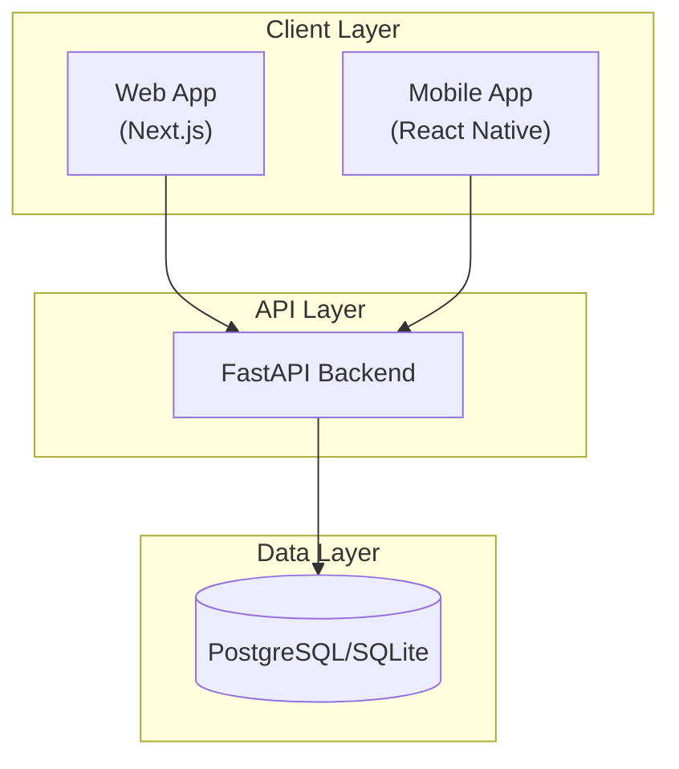

# NestFind

A **trust-first real estate transaction platform** that controls the entire property lifecycle — from listing to verification, visit, negotiation, reservation, and registration.

---

## About

NestFind is not a listing platform. It's a **controlled transaction system** that ensures:

- **Trust** — All properties are agent-verified before going live
- **Security** — Every action is validated by backend, logged immutably
- **Transparency** — State changes are auditable and visible
- **Anti-Fraud** — Platform controls all communication, no off-platform leakage

---

## Architecture



---

## Tech Stack

| Layer | Technology |
|-------|------------|
| Frontend (Web) | Next.js, React, TailwindCSS |
| Frontend (Mobile) | React Native, Expo, NativeWind |
| Backend | Python, FastAPI, SQLAlchemy |
| Database | PostgreSQL / SQLite |
| Authentication | JWT, Email OTP |

---

## Quick Start

See [SETUP_GUIDE.md](SETUP_GUIDE.md) for detailed installation instructions.

```bash
# Clone
git clone https://github.com/FindNest-Estate/NestFind.git
cd NestFind

# Backend
cd backend
pip install -r requirements.txt
uvicorn main:app --reload

# Frontend
cd ../frontend
npm install && npm run dev

# Mobile
cd ../mobile
npm install && npx expo start
```

---

## Documentation

| Document | Description |
|----------|-------------|
| [Overview](docs/overview.md) | Project vision and principles |
| [Getting Started](docs/getting-started.md) | Setup instructions |
| [System Design](docs/system_design.md) | Architecture and components |
| [Design Constitution](docs/DESIGN_CONSTITUTION.md) | UI/State rules |
| [Documentation Rules](docs/DOCUMENTATION_RULES.md) | Doc governance |
| [Workflow Naming](docs/WORKFLOW_NAMING_CONVENTION.md) | ID standards |
| [Workflow-API Map](docs/WORKFLOW_TO_API_MAPPING.md) | Endpoint mapping |

### Workflows

| Role | Location |
|------|----------|
| Authentication | [docs/workflows/auth/](docs/workflows/auth/) |
| Public | [docs/workflows/public/](docs/workflows/public/) |
| Buyer | [docs/workflows/buyer/](docs/workflows/buyer/) |
| Seller | [docs/workflows/seller/](docs/workflows/seller/) |
| Agent | [docs/workflows/agent/](docs/workflows/agent/) |
| Admin | [docs/workflows/admin/](docs/workflows/admin/) |
| System | [docs/workflows/system/](docs/workflows/system/) |

---

## Core Principles

1. **DB-First** — Database is the single source of truth
2. **State-Driven** — UI renders only what DB permits
3. **Trust-First** — No unverified listings, no anonymous actions
4. **Audit Everything** — Every mutation is logged immutably
5. **Anti-Disintermediation** — Platform controls all communication

---

## Project Structure

```
NestFind/
├── backend/          # FastAPI backend
├── frontend/         # Next.js web app
├── mobile/           # React Native mobile app
├── docs/             # Documentation
│   ├── workflows/    # Role-based workflow diagrams
│   └── *.md          # Design documents
├── SETUP_GUIDE.md    # Installation guide
└── README.md         # This file
```

---

## Contributing

1. Read [DOCUMENTATION_RULES.md](docs/DOCUMENTATION_RULES.md)
2. Follow [WORKFLOW_NAMING_CONVENTION.md](docs/WORKFLOW_NAMING_CONVENTION.md)
3. Ensure all changes are documented in corresponding workflow files
4. No undocumented state transitions
5. No optimistic UI updates

---

## License

MIT License — See [LICENSE](LICENSE) for details.

---

## Team

Built by FindNest Estate team.
