# NestFind — FAANG-Level Product & Business Report

**Document Version:** 1.0  
**Classification:** Confidential — Investor & Engineering Review  
**Last Updated:** January 20, 2026  
**Authors:** Product Strategy & Systems Architecture Team

---

## Table of Contents

1. [Executive Summary](#1-executive-summary)
2. [Actor-Wise Role Definition](#2-actor-wise-role-definition)
3. [End-to-End Workflow Diagrams](#3-end-to-end-workflow-diagrams)
4. [Financial & Commission Model](#4-financial--commission-model)
5. [Compliance & Legal Layer](#5-compliance--legal-layer-india-specific)
6. [Fraud Detection & Risk Controls](#6-fraud-detection--risk-controls)
7. [Technology Architecture](#7-technology-architecture-faang-style)
8. [Feature Completeness Matrix](#8-feature-completeness-matrix)
9. [Gaps Identified](#9-gaps-identified)
10. [Roadmap](#10-roadmap)
11. [KPIs & Metrics](#11-kpis--metrics)
12. [Future Enhancements](#12-future-enhancements)

---

## 1. Executive Summary

### 1.1 Vision

**NestFind is India's first trust-first, end-to-end real estate transaction platform** that controls the entire property lifecycle — from verification to registration — ensuring zero fraud, full transparency, and complete audit trails.

Unlike traditional listing platforms (99acres, MagicBricks, Housing.com) that lose transactional control after inquiry, NestFind **mandates platform-controlled interactions** for every stage: property verification, buyer visits, price negotiation, reservation deposits, and legal registration.

### 1.2 Core Value Proposition

| Stakeholder | Value Delivered |
|-------------|-----------------|
| **Buyers** | Verified listings only, GPS-confirmed visits, secure negotiation, protected deposits |
| **Sellers** | Serious buyers (via ₹5,000 posting fee filter), agent-verified property, guaranteed transaction completion |
| **Agents** | Verified income source, structured workflow, no off-platform leakage, commission on success |
| **Platform** | 0.25-0.35% take rate, recurring revenue from posting fees, full transaction visibility |

### 1.3 Market Differentiation

```mermaid
graph LR
    subgraph Traditional["Traditional Platforms"]
        A[Listing Only] --> B[Leads Generated]
        B --> C[Off-Platform Negotiation]
        C --> D[Zero Transaction Control]
    end
    
    subgraph NestFind["NestFind Model"]
        E[Verified Listing] --> F[Platform Visit]
        F --> G[In-App Negotiation]
        G --> H[Escrow Reservation]
        H --> I[Verified Registration]
        I --> J[Commission Split]
    end
    
    D -.->|"Lost Revenue"| X[No GMV Capture]
    J -->|"Full GMV Capture"| Y["₹1000+ Cr/Year Potential"]
```

### 1.4 Business Model Summary

| Revenue Stream | Source | Amount | Recipient |
|---------------|--------|--------|-----------|
| Property Posting Fee | Seller | ₹5,000 | 100% NestFind |
| Reservation Fee | Buyer | 0.1% of final price | 100% NestFind |
| Platform Commission (Single Agent) | Transaction | 0.25% of final price | NestFind Share |
| Platform Commission (Two Agents) | Transaction | 0.2% of final price | NestFind Share |

**At ₹1,000 Cr GMV/year:**
- Posting Fees: ₹2-5 Cr (assuming 4,000-10,000 listings)
- Reservation Fees: ₹1 Cr
- Commission Revenue: ₹2-2.5 Cr
- **Total Revenue Potential: ₹5-8.5 Cr/year**

---

## 2. Actor-Wise Role Definition

### 2.1 Admin

| Attribute | Details |
|-----------|---------|
| **Definition** | Platform super-user with full system authority |
| **Responsibilities** | Agent verification & approval, User account management, Dispute resolution, Fraud detection oversight, Platform configuration, Transaction approval for payout |
| **Permissions** | Full CRUD on all entities, Force status changes, Override agent decisions, Suspend/activate any account, Approve transactions for commission payout |
| **Risk Ownership** | Platform integrity, Compliance adherence, Agent quality, Fraud prevention |
| **Implementation Status** | ✅ Admin portal with 9 sections: dashboard, agents, users, properties, transactions, disputes, audit-logs, settings, system-health |

### 2.2 Seller

| Attribute | Details |
|-----------|---------|
| **Definition** | Property owner seeking to sell through the platform |
| **Responsibilities** | Complete property listing with accurate details, Pay ₹5,000 posting fee, Hire/accept agent assignment, Respond to offers, Attend registration |
| **Permissions** | Create/edit properties (DRAFT status only), View offers on properties, Accept/reject/counter offers, View transaction status |
| **Risk Ownership** | Property information accuracy, Document authenticity, Price decisions |
| **Implementation Status** | ✅ Seller dashboard with 10 sections: properties, analytics, offers, visits, transactions, settings |

### 2.3 Buyer

| Attribute | Details |
|-----------|---------|
| **Definition** | Property seeker browsing and purchasing through platform |
| **Responsibilities** | Search and shortlist properties, Book property visits, Make offers, Pay 0.1% reservation deposit, Pay commission on completion, Attend registration |
| **Permissions** | Browse ACTIVE properties, Save properties to collections, Request visits, Make/withdraw offers, Create reservations |
| **Risk Ownership** | Due diligence on property suitability, Offer decisions, Payment obligations |
| **Implementation Status** | ✅ Buyer flows: browse, save, collections, visits, offers, reservations, transactions |

### 2.4 Agent

| Attribute | Details |
|-----------|---------|
| **Definition** | Platform-verified professional mediating property transactions |
| **Responsibilities** | Accept/decline property assignments, Verify properties (GPS + documents), Conduct buyer visits, Mediate offer negotiations, Schedule and execute registrations |
| **Permissions** | Accept/decline assignments within 100km radius, Verify property status, Approve/reject visit requests, Mark visit completion, Schedule registration, Complete transaction |
| **Risk Ownership** | Property verification accuracy, Visit execution quality, Negotiation integrity |
| **Commission** | Single agent: Buyer 0.4% + Seller 0.5% = 0.9% (minus platform share). Two agents: Buyer 0.75% + Seller 0.7% = 1.45% (split between agents) |
| **Implementation Status** | ✅ Agent portal with 14 sections: dashboard, assignments, visits, offers, negotiations, registrations, transactions, analytics, calendar, documents, CRM, marketing, messages, verification |

### 2.5 System (Automations)

| Attribute | Details |
|-----------|---------|
| **Definition** | Automated processes running without human intervention |
| **Responsibilities** | OTP generation & verification, Reservation expiry (30-day timeout), Offer expiry enforcement, Notification dispatch (email + in-app), GPS distance calculations, SLA enforcement |
| **Implemented Jobs** | Scheduler with reservation expiry job, notification service, OTP service |
| **Implementation Status** | ✅ Background jobs scheduler, notification service, OTP service, email service |

---

## 3. End-to-End Workflow Diagrams

### 3.1 Registration & Verification

| Phase | Inputs | Outputs | State Transition | Failure Cases |
|-------|--------|---------|------------------|---------------|
| Submit Registration | Email, mobile, password, name | Pending verification record | None → PENDING_VERIFICATION | Duplicate email, weak password |
| Send OTP | User ID | OTP hash, expiry timestamp | - | Email delivery failure |
| Verify OTP | OTP code | Verified flag | PENDING_VERIFICATION → ACTIVE | Wrong OTP, expired, max attempts |

**Agent Registration Additional Flow:**

---

### 3.2 Property Posting

```mermaid
stateDiagram-v2
    [*] --> Draft: Seller creates property
    Draft --> PendingAssignment: Pay ₹5,000 + hire agent
    PendingAssignment --> Assigned: Agent accepts
    PendingAssignment --> Draft: Agent declines
    Assigned --> VerificationInProgress: Agent starts verification
    VerificationInProgress --> Active: Agent approves
    VerificationInProgress --> Draft: Agent rejects
    Active --> Reserved: Buyer reserves
    Active --> Inactive: Seller deactivates
    Reserved --> Active: Reservation expires
    Reserved --> Sold: Transaction completes
    Sold --> [*]
```

| Phase | Inputs | Outputs | State Transition | Failure Cases |
|-------|--------|---------|------------------|---------------|
| Create Property | Title, description, price, location, images | Property record | None → DRAFT | Invalid location, missing required fields |
| Pay Posting Fee | Payment reference | Payment log | DRAFT → ready for agent | Payment failure |
| Hire Agent | Agent selection | Assignment request | DRAFT → PENDING_ASSIGNMENT | No agents in radius |
| Agent Verification | GPS coordinates, verification notes, documents | Verification record | ASSIGNED → ACTIVE | Location mismatch, document issues |

---

### 3.3 Agent Assignment

**Distance-Based SLA:**

| Distance | Verification SLA |
|----------|-----------------|
| 0-20 km | 24 hours |
| 20-50 km | 48 hours |
| 50-100 km | 72 hours |

---

### 3.4 Property Visit

| Phase | Inputs | Outputs | State Transition | Failure Cases |
|-------|--------|---------|------------------|---------------|
| Request Visit | Property ID, preferred dates | Visit request | None → REQUESTED | Property not ACTIVE |
| Agent Response | Accept/reject/counter | Updated slot | REQUESTED → APPROVED/REJECTED/COUNTERED | Multiple pending requests |
| Start Visit | Agent GPS, buyer OTP | Verification record | APPROVED → IN_PROGRESS | GPS outside 50m radius |
| Complete Visit | Images, feedback, willingness | Visit completion | IN_PROGRESS → COMPLETED | Missing mandatory inputs |

---

### 3.5 Negotiation Engine

| Phase | Inputs | Outputs | State Transition | Failure Cases |
|-------|--------|---------|------------------|---------------|
| Create Offer | Property ID, offered price, message | Offer record | None → PENDING | Price negative, existing pending offer |
| Counter Offer | Counter price, message | Updated offer | PENDING/COUNTERED → COUNTERED | Invalid price |
| Accept Offer | Offer ID | Final agreed price | PENDING/COUNTERED → ACCEPTED | Already expired |

---

### 3.6 Reservation & Escrow Logic

| Phase | Inputs | Outputs | State Transition | Failure Cases |
|-------|--------|---------|------------------|---------------|
| Create Reservation | Offer ID, payment reference | Reservation record | Offer ACCEPTED → Reservation ACTIVE | Payment failure, property already reserved |
| Cancel Reservation | Cancellation reason | Property back to ACTIVE | ACTIVE → CANCELLED | - |
| Expire Reservation | System job | Property back to ACTIVE | ACTIVE → EXPIRED | - |

**Escrow vs Direct Payment:**
- **Current:** Direct payment with platform holding deposit until transaction completion
- **Recommended:** True escrow account integration for regulatory compliance

---

### 3.7 Registration Flow

| Phase | Inputs | Outputs | State Transition | Failure Cases |
|-------|--------|---------|------------------|---------------|
| Schedule Registration | Date, location | Transaction INITIATED | Reservation ACTIVE → Transaction INITIATED | Date past reservation expiry |
| GPS Verification | Agent coordinates | Verification log | - | Agent not at registration office |
| Buyer OTP | OTP code | verified_at timestamp | INITIATED → BUYER_VERIFIED | Wrong OTP, expired |
| Seller OTP | OTP code | verified_at timestamp | BUYER_VERIFIED → SELLER_VERIFIED | Wrong OTP, expired |
| Complete Transaction | Documents, signatures | Transaction COMPLETED | SELLER_VERIFIED → COMPLETED | Missing documents |

---

### 3.8 Payout & Settlement

---

## 4. Financial & Commission Model

### 4.1 Exact Flow of Money

```mermaid
flowchart LR
    subgraph Seller
        S1[Posting Fee ₹5,000]
        S2[Commission 0.5%]
    end
    
    subgraph Buyer
        B1[Reservation 0.1%]
        B2[Commission 0.4%]
    end
    
    subgraph Platform
        P1[NestFind Revenue]
        P2[Agent Payout Pool]
    end
    
    S1 --> P1
    B1 --> P1
    S2 --> P2
    B2 --> P2
    
    P2 --> |After GST| Agent
```

### 4.2 Commission Split Model

#### Single Agent Scenario (Total 0.9%)
| Party | Gross Contribution | To Platform | To Agent |
|-------|--------------------|------------|----------|
| Buyer | 0.4% | - | 0.40% |
| Seller | 0.5% | - | 0.50% |
| **Transaction** | **-** | **0.25%** | **-** |
| **Net Agent Earn** | **-** | **-** | **0.65%** |

> [!NOTE]
> NestFind takes a flat 0.25% of the final price as its commission from the deal. The agent receives the remaining 0.65% from the combined buyer/seller contributions.

#### Two Agent Scenario (Total 1.45%)
| Party | Gross Contribution | To Platform | To Buyer Agent | To Seller Agent |
|-------|--------------------|------------|----------------|-----------------|
| Buyer | 0.75% | - | 0.75% | - |
| Seller | 0.7% | - | - | 0.70% |
| **Transaction** | **-** | **0.2%** | **-** | **-** |
| **Net Agent Pool** | **-** | **-** | **0.65%** | **0.60%** |

> [!NOTE]
> In a two-agent deal, NestFind's commission is 0.2%. The remaining 1.25% is split between the Buyer Agent (0.65%) and Seller Agent (0.60%).

### 4.3 NestFind Revenue Breakdown

| Revenue Source | Type | Timing |
|---------------|------|--------|
| Posting Fee (₹5,000) | Fixed | Property submission |
| Reservation Fee (0.1%) | Variable | Offer acceptance |
| Platform Commission (0.2-0.25%) | Variable | Transaction completion |

### 4.4 Refund Handling

| Scenario | Refund Policy |
|----------|--------------|
| Reservation cancelled by buyer | **No refund** — deposit forfeited |
| Reservation expired (30 days) | **No refund** — deposit forfeited |
| Transaction failed (seller fault) | Full deposit refund to buyer |
| Platform dispute resolution | Case-by-case determination |

### 4.5 GST Handling

| Item | Treatment |
|------|-----------|
| Platform Commission | GST collected from agents |
| Agent Commission | Gross amount, agent responsible for GST filing |
| Posting Fee | Include GST in ₹5,000 |
| Reservation Fee | Include GST in 0.1% |

---

## 5. Compliance & Legal Layer (India-Specific)

### 5.1 KYC (Know Your Customer)

| Actor | Required Documents | Implementation Status |
|-------|-------------------|----------------------|
| User | Email verification, Mobile number | ✅ Implemented |
| Agent | Government ID (Aadhaar/PAN), Address proof, Business registration | ⚠️ Upload UI exists, verification manual |
| Seller | Property ownership documents | ⚠️ Part of property verification |

### 5.2 AML (Anti-Money Laundering)

| Requirement | Implementation | Status |
|-------------|---------------|--------|
| Transaction monitoring | Audit logs for all actions | ✅ Implemented |
| Suspicious activity reporting | Manual admin review | ⚠️ Partial |
| Cash transaction limits | Payment gateway integration | ⚠️ Not implemented |
| Source of funds verification | Not implemented | ❌ Missing |

### 5.3 RERA Considerations

| Requirement | Relevance | Status |
|-------------|----------|--------|
| RERA registration for new projects | Applies to builders, not resale | ⏸️ N/A for MVP |
| Agent registration validation | Recommended enhancement | ❌ Not implemented |
| Carpet area disclosure | Should be part of property details | ⚠️ Optional field |
| Penalty provisions | Platform liability | 📋 Legal review needed |

### 5.4 Digital Signatures

| Requirement | Implementation | Status |
|-------------|---------------|--------|
| Transaction agreement signing | Digital signature capture | ✅ Backend ready |
| Document storage | Signed documents stored | ✅ Implemented |
| Aadhaar e-Sign | Third-party integration | ❌ Not implemented |

### 5.5 Audit Trails

| Feature | Implementation | Status |
|---------|---------------|--------|
| Immutable action logs | `audit_logs` table with full entity tracking | ✅ Implemented |
| IP address tracking | Captured in all mutations | ✅ Implemented |
| Timestamp preservation | UTC timestamps | ✅ Implemented |
| User agent logging | Not implemented | ❌ Missing |

### 5.6 Data Retention

| Data Type | Recommended Retention | Status |
|-----------|----------------------|--------|
| User data | 7 years post-account closure | ⚠️ No deletion policy |
| Transaction records | 10 years | ✅ Permanent storage |
| Audit logs | 10 years | ✅ Permanent storage |
| OTP records | 30 days | ⚠️ No cleanup job |

---

## 6. Fraud Detection & Risk Controls

### 6.1 Fake Listings

| Risk | Control Mechanism | Status |
|------|------------------|--------|
| Fabricated properties | ₹5,000 posting fee barrier | ✅ Implemented |
| Duplicate listings | Address + location matching | ⚠️ Basic check only |
| Overpriced listings | Market rate comparison | ❌ Not implemented |
| Non-owner listings | Document verification by agent | ✅ Implemented |

### 6.2 Location Spoofing

| Risk | Control Mechanism | Status |
|------|------------------|--------|
| Fake GPS coordinates | Server-side validation of GPS accuracy | ⚠️ GPS captured, validation basic |
| Mock location apps | Device integrity check | ❌ Not implemented (mobile only) |
| Geofencing violation | 50-100m radius enforcement | ✅ Implemented |

### 6.3 OTP Abuse

| Risk | Control Mechanism | Status |
|------|------------------|--------|
| Brute force attacks | Max 3 attempts, lockout | ✅ Implemented |
| OTP sharing | Time-limited expiry (5-10 min) | ✅ Implemented |
| Replay attacks | One-time use, hash storage | ✅ Implemented |

### 6.4 Agent Collusion

| Risk | Control Mechanism | Status |
|------|------------------|--------|
| Fake visits | GPS + OTP dual verification | ✅ Implemented |
| Price manipulation | Full offer history tracking | ✅ Implemented |
| Off-platform dealing | Masked communication | ⚠️ Messaging exists, masking partial |
| Commission fraud | Admin approval before payout | ✅ Implemented |

### 6.5 Document Tampering

| Risk | Control Mechanism | Status |
|------|------------------|--------|
| Forged documents | Admin manual review | ✅ Implemented |
| Altered uploads | Hash verification | ❌ Not implemented |
| Version control | Document history | ❌ Not implemented |

### 6.6 Price Manipulation

| Risk | Control Mechanism | Status |
|------|------------------|--------|
| Artificial inflation | Price history tracking | ✅ Implemented |
| Collusion pricing | Market rate benchmarking | ❌ Not implemented |
| Below-market reporting | Transaction value verification | ⚠️ Manual review only |

---

## 7. Technology Architecture (FAANG-Style)

### 7.1 System Overview

### 7.2 Frontend Stack

| Component | Technology | Status |
|-----------|-----------|--------|
| Web Framework | Next.js 14+ (App Router) | ✅ Implemented |
| UI Library | React 18 + TypeScript | ✅ Implemented |
| Styling | Tailwind CSS | ✅ Implemented |
| State Management | React Context + SWR | ✅ Implemented |
| Authentication | JWT + Refresh Tokens | ✅ Implemented |
| Mobile | React Native (planned) | ⚠️ Structure exists |

### 7.3 Backend Stack

| Component | Technology | Status |
|-----------|-----------|--------|
| Framework | FastAPI (Python) | ✅ Implemented |
| Database | PostgreSQL 15+ | ✅ Implemented |
| Async | asyncpg connection pool | ✅ Implemented |
| Authentication | JWT (RS256) | ✅ Implemented |
| Background Jobs | APScheduler | ✅ Implemented |
| File Storage | Local filesystem | ✅ Implemented |

### 7.4 API Structure

| Module | Routers | Services | Status |
|--------|---------|----------|--------|
| Authentication | 5 (otp, login, session, refresh, register) | 6 | ✅ Complete |
| Properties | 5 (seller, media, public, stats, saved) | 4 | ✅ Complete |
| Agents | 3 (assignments, public, register) | 3 | ✅ Complete |
| Transactions | 5 (visits, offers, reservations, transactions, disputes) | 6 | ✅ Complete |
| Admin | 6 (agents, users, properties, transactions, audit, analytics) | 4 | ✅ Complete |
| Messaging | 2 (messaging, notifications) | 2 | ✅ Complete |

### 7.5 Database Schema

| Entity Group | Tables | Status |
|-------------|--------|--------|
| Identity & Access | users, sessions, email_otp_verifications, agent_profiles | ✅ Complete |
| Property System | properties, property_media, property_verifications, saved_properties, collections | ✅ Complete |
| Interaction System | agent_assignments, visit_requests, visit_verifications, visit_media, visit_feedback | ✅ Complete |
| Offer System | offers | ✅ Complete |
| Reservation System | reservations | ✅ Complete |
| Transaction System | transactions, payment_logs, transaction_documents | ✅ Complete |
| Audit System | audit_logs, admin_actions, disputes | ✅ Complete |

### 7.6 Event-Driven Architecture

| Event | Trigger | Actions | Status |
|-------|---------|---------|--------|
| User Registered | Registration complete | Send welcome email | ✅ Implemented |
| Agent Approved | Admin approval | Send approval notification | ✅ Implemented |
| Property Verified | Agent verification | Update status, notify seller | ✅ Implemented |
| Offer Received | Buyer creates offer | Notify seller, notify agent | ✅ Implemented |
| Reservation Created | Payment confirmed | Update property status, start timer | ✅ Implemented |
| Transaction Completed | All OTPs verified | Mark sold, trigger payout flow | ✅ Implemented |

---

## 8. Feature Completeness Matrix

### 8.1 Core Features

| Feature | Required | Implemented | Partial | Missing | Complexity |
|---------|----------|-------------|---------|---------|------------|
| User Registration (Email OTP) | ✅ | ✅ | - | - | Low |
| Agent Registration + Admin Approval | ✅ | ✅ | - | - | Medium |
| Property Listing (DRAFT to ACTIVE) | ✅ | ✅ | - | - | Medium |
| ₹5,000 Posting Fee | ✅ | - | ⚠️ | Payment gateway | Medium |
| Agent Assignment (100km radius) | ✅ | ✅ | - | - | Medium |
| Property Verification (GPS + Docs) | ✅ | ✅ | - | - | High |
| Property Visit Booking | ✅ | ✅ | - | - | Medium |
| Visit Day Verification (GPS + OTP) | ✅ | ✅ | - | - | High |
| Visit Feedback Collection | ✅ | ✅ | - | - | Low |
| Offer Creation | ✅ | ✅ | - | - | Medium |
| Offer Accept/Reject/Counter | ✅ | ✅ | - | - | High |
| Reservation (0.1% deposit) | ✅ | ✅ | ⚠️ | Payment gateway integration | High |
| Registration Scheduling | ✅ | ✅ | - | - | Medium |
| Registration Day (Multi-OTP) | ✅ | ✅ | - | - | High |
| Document Upload + Digital Sign | ✅ | ✅ | - | - | Medium |
| Commission Calculation | ✅ | ✅ | - | - | High |
| Admin Transaction Approval | ✅ | ✅ | - | - | Medium |
| Agent Payout (after GST) | ✅ | - | ⚠️ | Payout gateway | High |

### 8.2 Admin Features

| Feature | Required | Implemented | Partial | Missing | Complexity |
|---------|----------|-------------|---------|---------|------------|
| Admin Dashboard | ✅ | ✅ | - | - | Medium |
| Agent Approval/Rejection | ✅ | ✅ | - | - | Medium |
| User Management | ✅ | ✅ | - | - | Medium |
| Property Override | ✅ | ✅ | - | - | Low |
| Transaction Management | ✅ | ✅ | - | - | Medium |
| Dispute Resolution | ✅ | ✅ | - | - | High |
| Audit Log Viewer | ✅ | ✅ | - | - | Low |
| Platform Settings | ✅ | ✅ | - | - | Medium |
| System Health Dashboard | ✅ | ✅ | - | - | Medium |
| Fraud Detection Dashboard | ⚠️ | - | - | ❌ | High |

### 8.3 Seller Features

| Feature | Required | Implemented | Partial | Missing | Complexity |
|---------|----------|-------------|---------|---------|------------|
| Property Creation | ✅ | ✅ | - | - | Medium |
| Property Media Upload | ✅ | ✅ | - | - | Medium |
| Agent Hiring | ✅ | ✅ | - | - | Medium |
| Offer Management | ✅ | ✅ | - | - | Medium |
| Transaction View | ✅ | ✅ | - | - | Low |
| Seller Analytics | ✅ | ✅ | - | - | Medium |
| Settings & Preferences | ✅ | ✅ | - | - | Low |

### 8.4 Buyer Features

| Feature | Required | Implemented | Partial | Missing | Complexity |
|---------|----------|-------------|---------|---------|------------|
| Property Search | ✅ | ✅ | - | - | Medium |
| Property Save/Collections | ✅ | ✅ | - | - | Low |
| Visit Booking | ✅ | ✅ | - | - | Medium |
| Offer Making | ✅ | ✅ | - | - | Medium |
| Reservation Creation | ✅ | ✅ | - | - | Medium |
| Transaction View | ✅ | ✅ | - | - | Low |
| Market Insights | ⚠️ | ✅ | - | - | Medium |
| Price Drop Alerts | ⚠️ | ✅ | - | - | Medium |

### 8.5 Agent Features

| Feature | Required | Implemented | Partial | Missing | Complexity |
|---------|----------|-------------|---------|---------|------------|
| Assignment Management | ✅ | ✅ | - | - | Medium |
| Property Verification | ✅ | ✅ | - | - | High |
| Visit Management | ✅ | ✅ | - | - | Medium |
| GPS Verification | ✅ | ✅ | - | - | High |
| OTP Entry (Buyer/Seller) | ✅ | ✅ | - | - | Medium |
| Document Upload | ✅ | ✅ | - | - | Medium |
| Agent Analytics | ✅ | ✅ | - | - | Medium |
| Calendar View | ✅ | ✅ | - | - | Medium |
| Earnings Dashboard | ✅ | ✅ | - | - | Medium |
| CRM Features | ⚠️ | ✅ | - | - | Medium |

---

## 9. Gaps Identified

### 9.1 Business Gaps

| Gap | Severity | Impact | Recommendation |
|-----|----------|--------|----------------|
| No payment gateway integration | 🔴 Critical | Cannot collect posting fees, reservations | Integrate Razorpay/PayU |
| No payout infrastructure | 🔴 Critical | Cannot pay agents | Integrate payout API (Razorpay X) |
| No escrow implementation | 🟠 High | Regulatory risk for holding deposits | Partner with escrow provider |
| Location-based commission not implemented | 🟡 Medium | Future feature described | Phase 2 implementation |
| No buyer-side agent hiring flow | 🟠 High | Two-agent scenario incomplete | Implement buyer agent assignment |

### 9.2 Technology Gaps

| Gap | Severity | Impact | Recommendation |
|-----|----------|--------|----------------|
| No real-time notifications | 🟡 Medium | UX degradation | Add WebSocket/SSE support |
| No push notifications (mobile) | 🟠 High | Mobile engagement | Integrate Firebase FCM |
| No SMS fallback for OTP | 🟡 Medium | Email-only limits accessibility | Add SMS provider (MSG91) |
| No CDN for media | 🟡 Medium | Slow image loading | Add CloudFront/CloudFlare |
| No caching layer | 🟡 Medium | DB load at scale | Add Redis |

### 9.3 Legal Gaps

| Gap | Severity | Impact | Recommendation |
|-----|----------|--------|----------------|
| No privacy policy | 🔴 Critical | Legal compliance | Draft and publish |
| No terms of service | 🔴 Critical | User agreement | Draft and publish |
| No RERA validation | 🟡 Medium | Agent credibility | Optional verification |
| No Aadhaar e-Sign | 🟡 Medium | Document validity | Integrate DigiLocker |

### 9.4 UX Gaps

| Gap | Severity | Impact | Recommendation |
|-----|----------|--------|----------------|
| No onboarding tutorial | 🟡 Medium | User drop-off | Add guided tours |
| No search filters (advanced) | 🟡 Medium | Discovery friction | Add bedrooms, amenities filters |
| No map-based search | 🟠 High | Location-first UX missing | Add Google Maps integration |
| No chat support | 🟡 Medium | Customer service | Add Intercom/Freshdesk |

### 9.5 Scaling Gaps

| Gap | Severity | Impact | Recommendation |
|-----|----------|--------|----------------|
| Single database instance | 🟠 High | SPOF, capacity limit | Add read replicas |
| No horizontal scaling | 🟠 High | Throughput limits | Containerize with K8s |
| No load balancing | 🟠 High | Server bottleneck | Add nginx/ALB |
| No monitoring/alerting | 🟠 High | Blind operations | Add Datadog/Grafana |
| No automated testing | 🟠 High | Regression risk | Add pytest, Playwright |

---

## 10. Roadmap

### 10.1 MVP (0-3 Months)

| Priority | Feature | Effort | Status |
|----------|---------|--------|--------|
| P0 | Payment gateway integration (Razorpay) | 2 weeks | 🔲 Not started |
| P0 | Privacy policy & Terms of Service | 1 week | 🔲 Not started |
| P0 | Production deployment (AWS/GCP) | 2 weeks | 🔲 Not started |
| P0 | Basic monitoring (uptime, errors) | 1 week | 🔲 Not started |
| P1 | SMS OTP fallback | 1 week | 🔲 Not started |
| P1 | Agent payout integration | 2 weeks | 🔲 Not started |
| P1 | User onboarding flow | 1 week | 🔲 Not started |

**MVP Exit Criteria:**
- [ ] End-to-end transaction completable with real payments
- [ ] Legal documents published
- [ ] Production environment stable
- [ ] 95% uptime SLA

### 10.2 V1 (3-6 Months)

| Priority | Feature | Effort |
|----------|---------|--------|
| P0 | Two-agent (buyer-side) flow | 3 weeks |
| P1 | Push notifications (mobile) | 2 weeks |
| P1 | Advanced search filters | 2 weeks |
| P1 | Map-based property search | 3 weeks |
| P1 | CDN for media assets | 1 week |
| P2 | Chat support integration | 2 weeks |
| P2 | Agent reputation scoring | 3 weeks |

### 10.3 V2 (6-12 Months)

| Priority | Feature | Effort |
|----------|---------|--------|
| P0 | Location-based commission | 4 weeks |
| P1 | AI price prediction | 6 weeks |
| P1 | Smart document verification (OCR) | 4 weeks |
| P1 | LLM negotiation assistant | 6 weeks |
| P2 | Rental listings | 8 weeks |
| P2 | Builder project listings | 8 weeks |
| P2 | Loan marketplace integration | 6 weeks |

---

## 11. KPIs & Metrics

### 11.1 Conversion Funnel

| Stage | Metric | Target | Calculation |
|-------|--------|--------|-------------|
| Registration | Sign-up Rate | 30% | Visitors → Registrations |
| Activation | Activation Rate | 50% | Registrations → First Action (save/visit) |
| Property Listing | Listing Completion | 60% | Draft → Active |
| Visit | Visit Conversion | 40% | Visit Requests → Completed Visits |
| Offer | Offer Rate | 25% | Visits → Offers |
| Acceptance | Acceptance Rate | 20% | Offers → Accepted |
| Reservation | Reservation Rate | 80% | Accepted Offers → Reservations |
| Completion | Transaction Rate | 85% | Reservations → Completed Transactions |

### 11.2 Agent Performance

| Metric | Description | Target |
|--------|-------------|--------|
| Assignment Acceptance Rate | % of assignments accepted | > 80% |
| Verification SLA Compliance | % completed within SLA | > 90% |
| Visit Completion Rate | % of approved visits completed | > 95% |
| Transaction Success Rate | % of reservations → completions | > 85% |
| Average Rating | User ratings | > 4.5/5 |

### 11.3 Fraud Metrics

| Metric | Description | Target |
|--------|-------------|--------|
| Fake Listing Rate | % of listings rejected for fraud | < 5% |
| GPS Spoofing Incidents | Detected spoofing attempts | < 1% |
| Dispute Rate | % of transactions disputed | < 3% |
| Chargeback Rate | Payment chargebacks | < 0.5% |

### 11.4 Revenue Metrics

| Metric | Description | Target |
|--------|-------------|--------|
| GMV (Gross Merchandise Value) | Total transaction value | ₹100 Cr → ₹1,000 Cr |
| Take Rate | Platform revenue / GMV | 0.35% |
| Revenue per Active User | Total revenue / MAU | ₹500/month |
| Customer Acquisition Cost | Marketing spend / new users | < ₹200 |
| Lifetime Value | Average revenue per user | > ₹1,000 |

### 11.5 Retention Metrics

| Metric | Description | Target |
|--------|-------------|--------|
| DAU/MAU Ratio | Daily/Monthly active users | > 20% |
| Seller Repeat Rate | Sellers with 2+ listings | > 15% |
| Buyer Repeat Rate | Buyers with 2+ transactions | > 10% |
| Agent Retention | Agents active after 6 months | > 70% |

---

## 12. Future Enhancements

### 12.1 Location-Based Dynamic Commission

**Implementation:**
- City classification database
- Configurable commission rules engine
- Admin override capability

### 12.2 AI Price Prediction

| Feature | Description | Technology |
|---------|-------------|------------|
| Automated Valuation Model | Estimate property value | ML regression (XGBoost) |
| Price Range Suggestions | Guide sellers on listing price | Historical data analysis |
| Trend Forecasting | Price movement predictions | Time-series models |

### 12.3 Agent Scoring Algorithm

| Factor | Weight | Calculation |
|--------|--------|-------------|
| Transaction Success Rate | 30% | Completed / Assigned |
| Verification SLA Compliance | 20% | On-time / Total |
| User Ratings | 25% | Average rating |
| Response Time | 15% | Median response time |
| Dispute Rate | 10% | 1 - (Disputes / Transactions) |

### 12.4 Smart Document Verification

| Capability | Technology | Status |
|------------|-----------|--------|
| OCR Extraction | Google Vision / AWS Textract | Planned |
| Document Classification | Custom ML model | Planned |
| Authenticity Check | Digital signatures verification | Planned |
| Auto-fill from Documents | NLP entity extraction | Planned |

### 12.5 LLM Negotiation Assistant

| Feature | Description |
|---------|-------------|
| Offer Suggestions | AI-recommended counter prices |
| Message Templates | Context-aware communication drafts |
| Negotiation Insights | Analysis of historical patterns |
| Deal Probability | ML-based transaction success prediction |

---

## Appendix A: Implementation Summary

### Current Implementation Status

| Component | Files | Lines of Code | Status |
|-----------|-------|---------------|--------|
| Backend Routers | 35 | ~8,000 | ✅ Complete |
| Backend Services | 30 | ~15,000 | ✅ Complete |
| Database Migrations | 22 | ~2,500 | ✅ Complete |
| Frontend Pages | ~80 | ~25,000 | ✅ Complete |
| Mobile App | 1 directory | Structure only | ⚠️ Not started |

### Database Tables Count

| Category | Count |
|----------|-------|
| Identity & Access | 4 |
| Property System | 5 |
| Interaction System | 6 |
| Transaction System | 3 |
| Audit System | 3 |
| **Total** | **21** |

---

## Appendix B: API Endpoint Summary

| Category | Endpoints | Auth Required |
|----------|-----------|---------------|
| Authentication | 8 | Mixed |
| Public Properties | 6 | No |
| Seller Properties | 12 | Yes |
| Agent Operations | 15 | Yes |
| Buyer Operations | 10 | Yes |
| Admin Operations | 18 | Yes (Admin) |
| Transactions | 12 | Yes |
| **Total** | **~81** | |

---

*Document prepared for investor review, engineering implementation, and compliance audit.*

**NestFind Platform — Building Trust in Real Estate Transactions**
