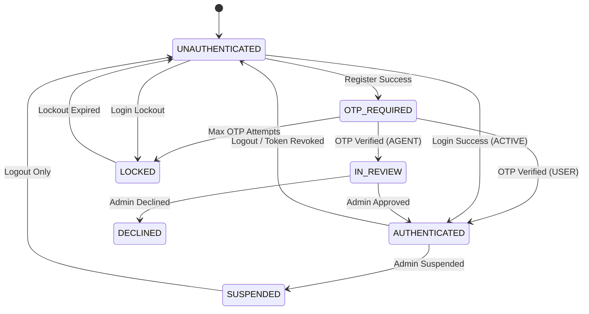

# Frontend Authentication State Machine

## Overview

This document defines the **exact** UI behavior for every authentication state. Frontend MUST enforce these rules using backend responses as the single source of truth.

---

## State Diagram



---

## State Definitions

### 1. UNAUTHENTICATED

**Condition:** No valid tokens OR tokens cleared.

| Allowed Screens | Blocked Actions | Backend Check Required |
|-----------------|-----------------|------------------------|
| Landing Page | Access any dashboard | None |
| Login Page | View protected content | None |
| Register (User) Page | Perform authenticated actions | None |
| Register (Agent) Page | | None |
| Public Property Listings | | None |

**Transitions:**
| Action | API Call | Next State |
|--------|----------|------------|
| Submit Login | `POST /auth/login` | `AUTHENTICATED` (if success) |
| Submit Login | `POST /auth/login` | `LOCKED` (if lockout) |
| Submit Registration | `POST /auth/register/user` | `OTP_REQUIRED` |
| Submit Registration | `POST /auth/register/agent` | `OTP_REQUIRED` |

---

### 2. OTP_REQUIRED

**Condition:** User registered, awaiting email verification. `status = PENDING_VERIFICATION`

| Allowed Screens | Blocked Actions | Backend Check Required |
|-----------------|-----------------|------------------------|
| OTP Entry Screen | Login | None (state derived from registration flow) |
| Resend OTP Button | Access any dashboard | None |
| | View protected content | |

**Transitions:**
| Action | API Call | Next State |
|--------|----------|------------|
| Submit OTP (USER) | `POST /auth/otp/verify` | `AUTHENTICATED` (status becomes ACTIVE) |
| Submit OTP (AGENT) | `POST /auth/otp/verify` | `IN_REVIEW` (status becomes IN_REVIEW) |
| Max Failed Attempts | `POST /auth/otp/verify` | `LOCKED` |
| Resend OTP | `POST /auth/otp/generate` | `OTP_REQUIRED` (stay) |

**UI Rules:**
- Show remaining attempts from API response
- Disable "Verify" button during lockout period
- Show countdown timer if `locked_until` present

---

### 3. AUTHENTICATED

**Condition:** Valid JWT + `user.status = ACTIVE`

| Role | Allowed Screens | Blocked Actions | Backend Check Required |
|------|-----------------|-----------------|------------------------|
| USER | Buyer Dashboard, Seller Dashboard, Property Views, Profile | Admin Panel, Agent Dashboard | `GET /user/me` on app load |
| AGENT | Agent Dashboard, Listings Management, Client Views, Profile | Admin Panel | `GET /user/me` on app load |
| ADMIN | Admin Dashboard, Agent Approval, User Management, All | None | `GET /user/me` on app load |

**Transitions:**
| Action | API Call | Next State |
|--------|----------|------------|
| Logout | `POST /auth/logout` | `UNAUTHENTICATED` |
| Token Expired + Refresh Fails | `POST /auth/refresh` (401) | `UNAUTHENTICATED` |
| API Returns 403 (Suspended) | Any Protected Endpoint | `SUSPENDED` |

**UI Rules:**
- Re-verify `user.status` and `user.role` from `/user/me` on every app load
- Never cache role/status locally for authorization decisions
- Show role-appropriate navigation only

---

### 4. IN_REVIEW

**Condition:** Agent user, `status = IN_REVIEW`, OTP verified but awaiting admin approval.

| Allowed Screens | Blocked Actions | Backend Check Required |
|-----------------|-----------------|------------------------|
| "Application Under Review" Screen | Access Agent Dashboard | `GET /user/me` on app load |
| Profile View (Read-Only) | Create Listings | |
| Logout Button | Accept Clients | |
| | Any agent-specific action | |

**Transitions:**
| Action | API Call | Next State |
|--------|----------|------------|
| Admin Approves | N/A (Poll or WebSocket) | `AUTHENTICATED` |
| Admin Declines | N/A (Poll or WebSocket) | `DECLINED` |
| Logout | `POST /auth/logout` | `UNAUTHENTICATED` |

**UI Rules:**
- Polling recommended: `GET /user/me` every 30 seconds
- If `status` changes to `ACTIVE`, redirect to Agent Dashboard
- If `status` changes to `DECLINED`, redirect to Declined Screen
- NO agent functionality accessible

---

### 5. DECLINED

**Condition:** Agent user, `status = DECLINED`, admin rejected application.

| Allowed Screens | Blocked Actions | Backend Check Required |
|-----------------|-----------------|------------------------|
| "Application Declined" Screen | Login (as agent) | `GET /user/me` on app load |
| Contact Support Link | Any authenticated action | |
| | Re-apply (without new account) | |

**Transitions:**
| Action | API Call | Next State |
|--------|----------|------------|
| Logout | `POST /auth/logout` | `UNAUTHENTICATED` |

**UI Rules:**
- Show decline reason if available
- Provide contact/support link
- No re-application button (requires new registration)

---

### 6. SUSPENDED

**Condition:** Any user, `status = SUSPENDED`, admin suspended account.

| Allowed Screens | Blocked Actions | Backend Check Required |
|-----------------|-----------------|------------------------|
| "Account Suspended" Screen | Any authenticated action | `GET /user/me` on app load |
| Contact Support Link | View any protected content | |
| Logout Button | | |

**Transitions:**
| Action | API Call | Next State |
|--------|----------|------------|
| Logout | `POST /auth/logout` | `UNAUTHENTICATED` |

**UI Rules:**
- Immediate redirect on any 403 with suspension reason
- Clear all tokens after showing message
- Provide support contact

---

### 7. LOCKED

**Condition:** Temporary lockout due to brute force protection. `locked_until` timestamp present.

| Allowed Screens | Blocked Actions | Backend Check Required |
|-----------------|-----------------|------------------------|
| Login Page (with lockout message) | Submit Login | None (use `locked_until` from response) |
| OTP Page (with lockout message) | Submit OTP | |
| Countdown Timer | Resend OTP (during lockout) | |

**Transitions:**
| Action | API Call | Next State |
|--------|----------|------------|
| Lockout Expires (client-side timer) | None | `UNAUTHENTICATED` (re-enable form) |

**UI Rules:**
- Parse `locked_until` from API response
- Show countdown: "Try again in X:XX"
- Disable submit button until countdown completes
- After countdown, return to normal form state

---

## Global Enforcement Rules

### On Every Protected Route:
```typescript
// Pseudocode
async function checkAuthState(): AuthState {
  const tokens = getStoredTokens();
  if (!tokens) return 'UNAUTHENTICATED';
  
  const response = await fetch('/user/me', { headers: { Authorization: `Bearer ${tokens.access}` } });
  
  if (response.status === 401) {
    const refreshed = await refreshToken();
    if (!refreshed) return 'UNAUTHENTICATED';
    return checkAuthState(); // Retry
  }
  
  const user = await response.json();
  
  switch (user.status) {
    case 'PENDING_VERIFICATION': return 'OTP_REQUIRED';
    case 'ACTIVE': return 'AUTHENTICATED';
    case 'IN_REVIEW': return 'IN_REVIEW';
    case 'DECLINED': return 'DECLINED';
    case 'SUSPENDED': return 'SUSPENDED';
  }
}
```

### On Any 403 Response:
```typescript
// Pseudocode
function handleForbidden(response) {
  const user = getCurrentUser();
  if (user?.status === 'SUSPENDED') redirectTo('/suspended');
  if (user?.status === 'IN_REVIEW') redirectTo('/under-review');
  if (user?.status === 'DECLINED') redirectTo('/declined');
  // Role mismatch
  redirectTo('/unauthorized');
}
```

### On Any 429 Response:
```typescript
function handleRateLimit(response) {
  showToast("Too many requests. Please wait.");
  // Optionally disable action for X seconds
}
```

---

## State Persistence Rules

| Data | Storage | Lifetime |
|------|---------|----------|
| `access_token` | Memory OR Secure Cookie | Until logout or expiry |
| `refresh_token` | Secure HTTP-Only Cookie | 7 days |
| `user.role` | **NEVER STORE** | Fetch from `/user/me` |
| `user.status` | **NEVER STORE** | Fetch from `/user/me` |

**CRITICAL:** Role and status must ALWAYS be fetched fresh. Never use cached values for authorization.

