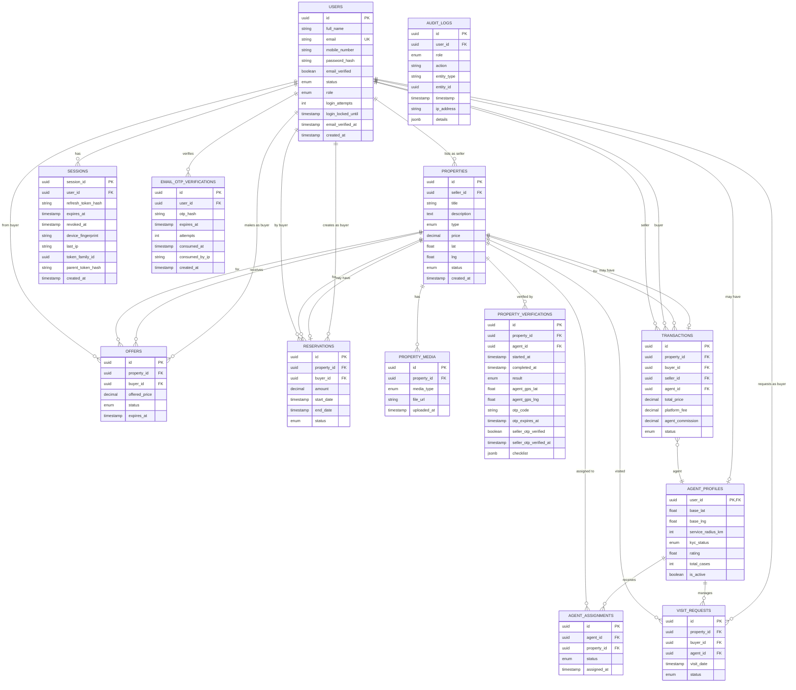
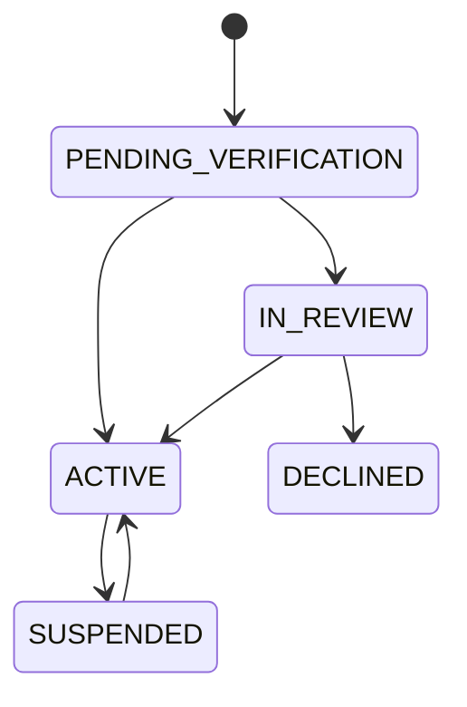
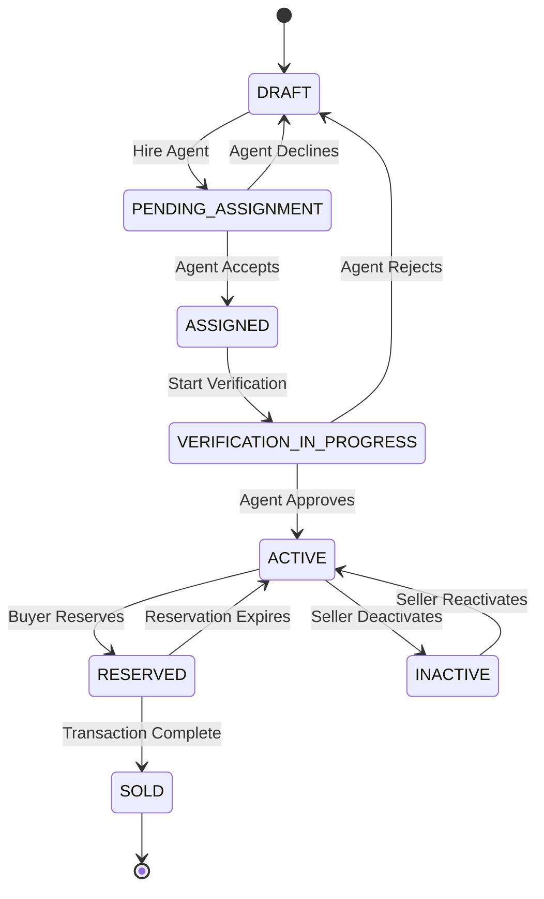
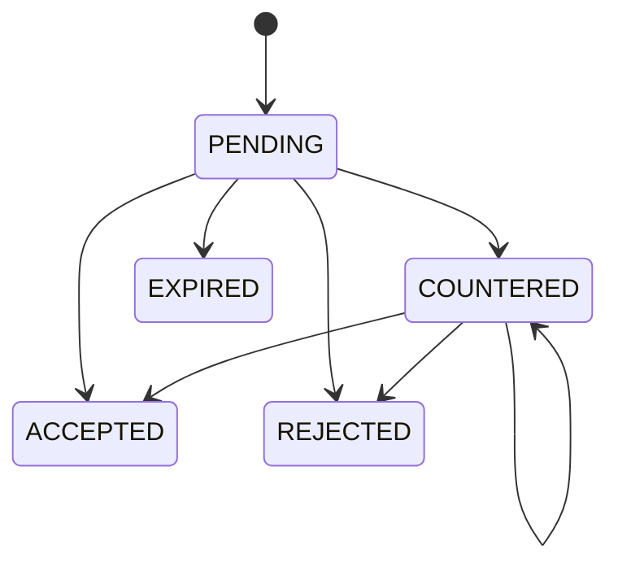

# NestFind Database Schema

Complete database schema with entity relationships and Mermaid ER diagrams.

---

## Entity Relationship Diagram

---

## Table Descriptions

### Identity & Access

| Table | Purpose | Primary Key |
|-------|---------|-------------|
| `users` | All platform users | `id` (UUID) |
| `email_otp_verifications` | OTP tracking | `id` |
| `sessions` | JWT session tracking | `session_id` (UUID) |
| `agent_profiles` | Agent-specific data | `user_id` (FK) |

### Property System

| Table | Purpose | Primary Key |
|-------|---------|-------------|
| `properties` | Property listings | `id` (UUID) |
| `property_media` | Images/videos | `id` |
| `property_verifications` | Verification records | `id` |

### Interaction System

| Table | Purpose | Primary Key |
|-------|---------|-------------|
| `agent_assignments` | Agent-property links | `id` |
| `visit_requests` | Visit scheduling | `id` |
| `visit_verifications` | Visit proof | `visit_id` |
| `offers` | Buyer offers | `id` |
| `reservations` | Property locks | `id` |

### Transaction System

| Table | Purpose | Primary Key |
|-------|---------|-------------|
| `transactions` | Completed deals | `id` |
| `payment_logs` | Payment tracking | `id` |

### Audit & Admin

| Table | Purpose | Primary Key |
|-------|---------|-------------|
| `audit_logs` | Immutable action log | `id` |
| `admin_actions` | Admin decisions | `id` |
| `disputes` | Dispute records | `id` |

---

## Status Enums

### User Status

### Property Status

### Offer Status

---

## Indexing Strategy

| Table | Index | Purpose |
|-------|-------|---------|
| `users` | `email` (unique) | Login lookup |
| `properties` | `seller_id` | Owner queries |
| `properties` | `status` | Listing filters |
| `properties` | `lat, lng` | Geo queries |
| `agent_profiles` | `base_lat, base_lng` | Geo queries |
| `offers` | `property_id, status` | Offer queries |
| `audit_logs` | `entity_type, entity_id` | History lookup |
