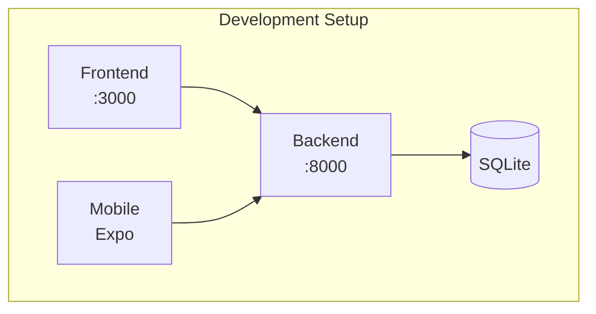

# Getting Started

**Version:** 1.0 | **Last Updated:** December 19, 2024

---

## Prerequisites

| Requirement | Version | Purpose |
|-------------|---------|---------|
| Git | Latest | Version control |
| Python | 3.9+ | Backend runtime |
| Node.js | 18+ LTS | Frontend runtime |
| Ollama | Latest | AI features (optional) |

---

## Architecture Overview



---

## Quick Start

### 1. Clone Repository

```bash
git clone https://github.com/FindNest-Estate/NestFind.git
cd NestFind
```

### 2. Backend Setup

```bash
cd backend

# Create virtual environment
python -m venv venv

# Activate (Windows)
.\venv\Scripts\activate

# Activate (Mac/Linux)
source venv/bin/activate

# Install dependencies
pip install -r requirements.txt

# Create .env file
cp .env.example .env
# Edit .env with your settings

# Run server
uvicorn main:app --reload
```

Backend runs at: `http://localhost:8000`

API docs at: `http://localhost:8000/docs`

### 3. Frontend Setup

```bash
cd frontend

# Install dependencies
npm install

# Run development server
npm run dev
```

Frontend runs at: `http://localhost:3000`

### 4. Mobile Setup

```bash
cd mobile

# Install dependencies
npm install

# Start Expo
npx expo start
```

Scan QR code with Expo Go app.

---

## Environment Configuration

### Backend (.env)

```env
# Database
DATABASE_URL=sqlite:///./nestfind.db

# Security
SECRET_KEY=your_secret_key_here
ALGORITHM=HS256
ACCESS_TOKEN_EXPIRE_MINUTES=30

# Optional: AI
OLLAMA_HOST=http://localhost:11434
```

---

## Database

### Default: SQLite

SQLite database is created automatically at `backend/nestfind.db`.

### Schema Creation

Database tables are auto-created on first run if using SQLAlchemy's `create_all()`.

### Fresh Start

To reset database:

```bash
# Delete database file
rm backend/nestfind.db

# Restart backend (recreates tables)
uvicorn main:app --reload
```

---

## Admin Account

Create default admin:

```bash
cd backend
python -m scripts.create_admin
```

Credentials:
- Email: `nestfind@gmail.com`
- Password: `123456789`

---

## AI Features (Optional)

### Setup Ollama

1. Install from [ollama.com](https://ollama.com)
2. Pull required models:

```bash
ollama pull llama3.1:8b
ollama pull mistral:7b
```

3. Start Ollama server:

```bash
ollama serve
```

---

## Verification Checklist

After setup, verify:

- [ ] Backend responds at `http://localhost:8000/docs`
- [ ] Frontend loads at `http://localhost:3000`
- [ ] Mobile connects to backend
- [ ] Can create user account
- [ ] Can login successfully

---

## Troubleshooting

| Issue | Solution |
|-------|----------|
| Database errors | Delete `nestfind.db` and restart |
| AI errors | Ensure Ollama is running |
| CORS errors | Check backend CORS settings |
| Mobile connection | Use correct backend IP |

---

## Next Steps

1. Read [Overview](overview.md) for project understanding
2. Read [DESIGN_CONSTITUTION.md](DESIGN_CONSTITUTION.md) for rules
3. Explore [Workflows](workflows/) for business logic
