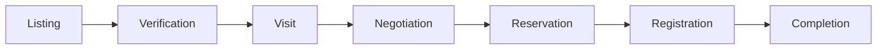
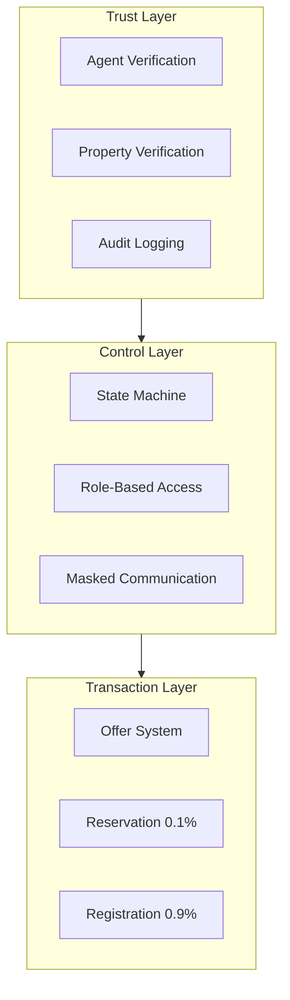
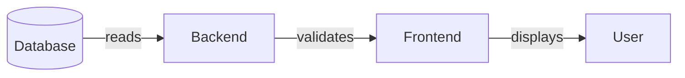
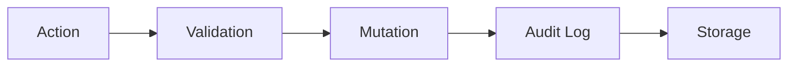

# NestFind Overview

**Version:** 1.0 | **Last Updated:** December 19, 2024

---

## Product Vision

NestFind is a **trust-first real estate transaction platform** that connects buyers, sellers, and platform-verified agents.

Unlike listing platforms, NestFind **controls the entire transaction lifecycle**:

---

## Core Problem

Traditional real estate platforms suffer from:

| Problem | Impact |
|---------|--------|
| Fake listings | Wasted buyer time |
| Unverified agents | Fraud risk |
| Off-platform negotiation | Lost visibility |
| No transaction control | Disputes |

---

## NestFind Solution

---

## Core Actors

| Role | Description | Key Actions |
|------|-------------|-------------|
| **Buyer** | Property seeker | Browse, visit, offer, reserve |
| **Seller** | Property owner | List, hire agent, accept offers |
| **Agent** | Platform-verified mediator | Verify, conduct visits, close deals |
| **Admin** | Platform authority | Approve agents, resolve disputes |

---

## Design Principles

### 1. Database is Truth

- Frontend never invents state
- Backend validates all transitions
- Database is single source of truth

### 2. State-Driven UI

Every UI element is controlled by database state:

| State | UI Result |
|-------|-----------|
| `DRAFT` | "Complete Listing" button |
| `PENDING_VERIFY` | "Awaiting Verification" badge |
| `ACTIVE` | "Book Visit" button |
| `RESERVED` | Countdown timer |
| `SOLD` | Read-only view |

### 3. Trust-First

- No anonymous actions
- No unverified listings
- Agent involvement mandatory
- All communication platform-controlled

### 4. Audit Everything

Every mutation creates immutable audit record.

---

## Key Documents

| Document | Purpose |
|----------|---------|
| [DESIGN_CONSTITUTION.md](DESIGN_CONSTITUTION.md) | UI/State rules |
| [DOCUMENTATION_RULES.md](DOCUMENTATION_RULES.md) | Doc governance |
| [system_design.md](system_design.md) | Technical architecture |
| [business_design_document.md](business_design_document.md) | Business workflows |

---

## What's Explicitly Out of Scope

- AI features (future)
- Loans & rentals (future)
- Subscriptions (future)
- External integrations (future)
