# 📊 NESTFIND — VISUAL WORKFLOW DIAGRAMS

*Complete visual representation of all business workflows and system flows*

---

## 1. USER REGISTRATION WORKFLOW (BUYER / SELLER)

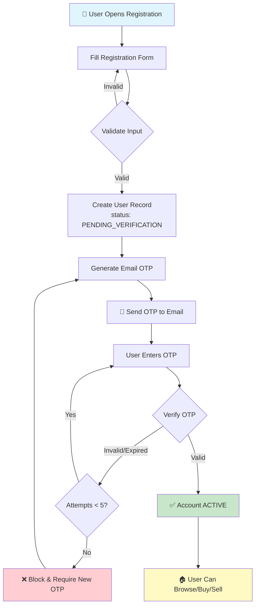

**Key Points:**
- Single registration for both Buyer & Seller
- Email OTP verification only (no SMS)
- Role assigned based on user actions (list = Seller, offer = Buyer)

---

## 2. AGENT REGISTRATION WORKFLOW

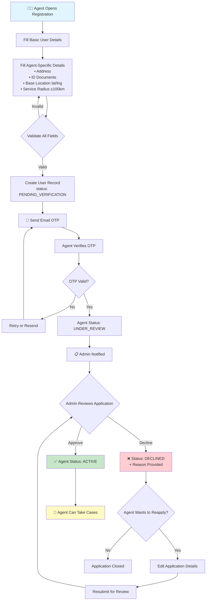

**Agent Status Lifecycle:**
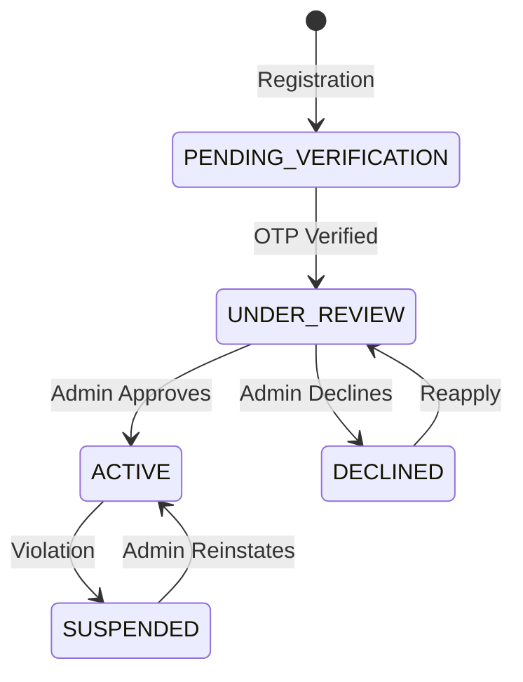

---

## 3. PROPERTY LISTING WORKFLOW (SELLER)

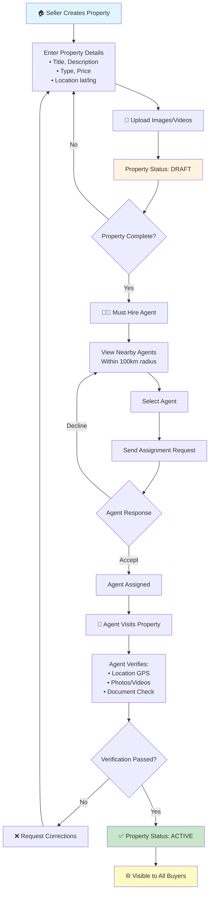

**Property Status Lifecycle:**
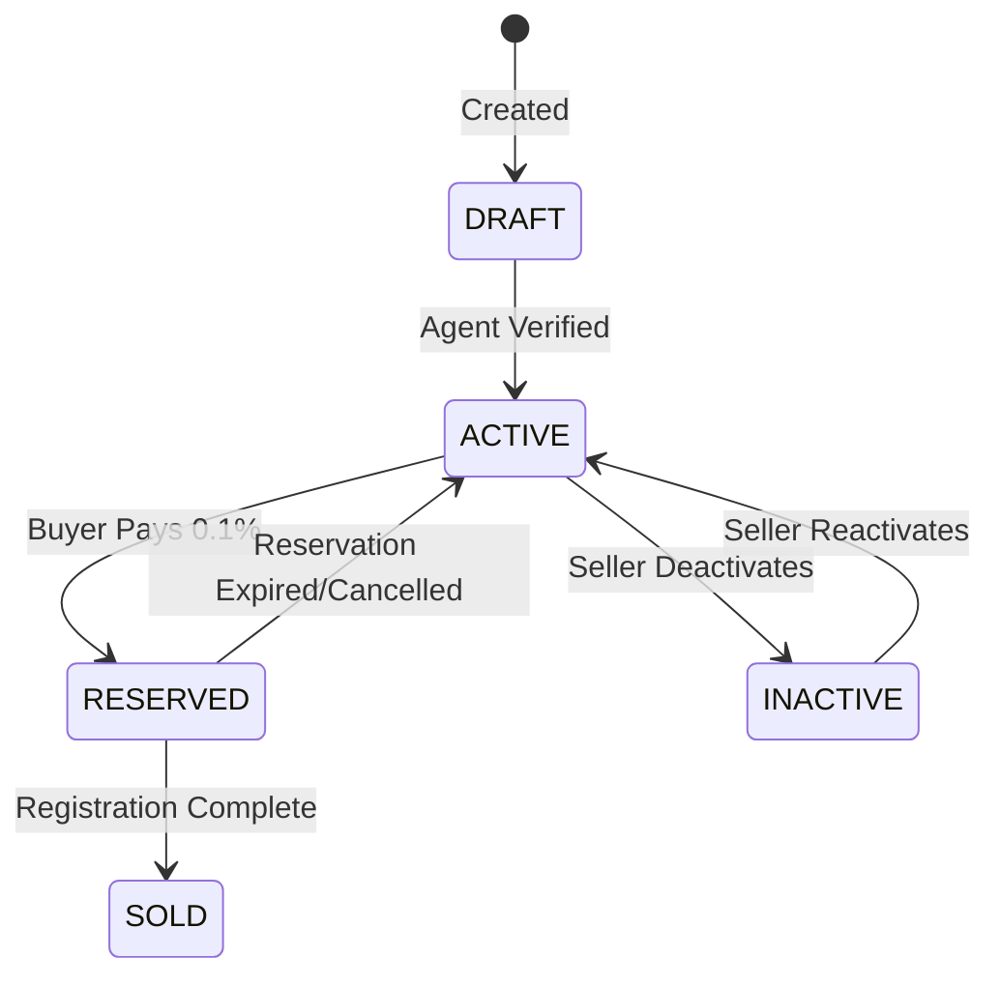

---

## 4. AGENT ASSIGNMENT WORKFLOW

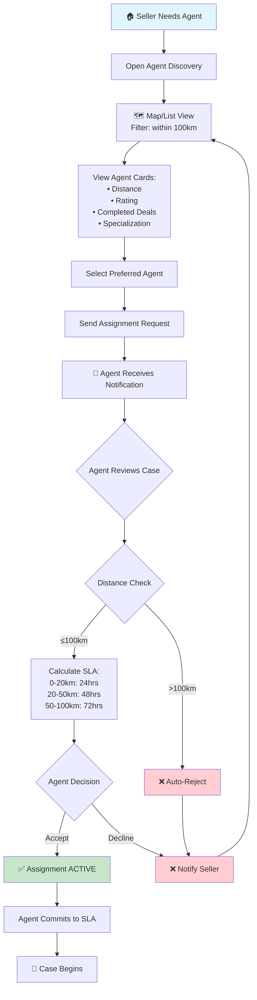

**Distance-Based SLA Table:**
| Distance | Max Visit Time | Priority |
|----------|---------------|----------|
| 0-20 km  | 24 hours      | High     |
| 20-50 km | 48 hours      | Medium   |
| 50-100 km| 72 hours      | Standard |

---

## 5. PROPERTY VISIT WORKFLOW (BUYER)

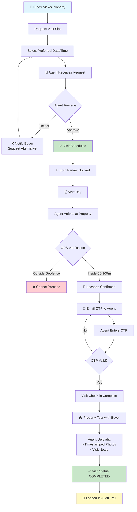

**Visit Status Lifecycle:**
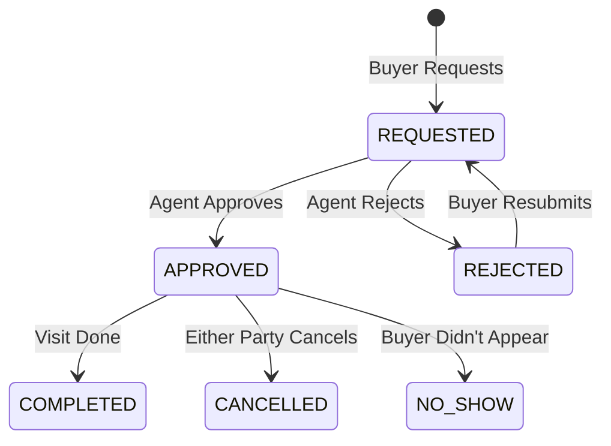

---

## 6. OFFER & NEGOTIATION WORKFLOW

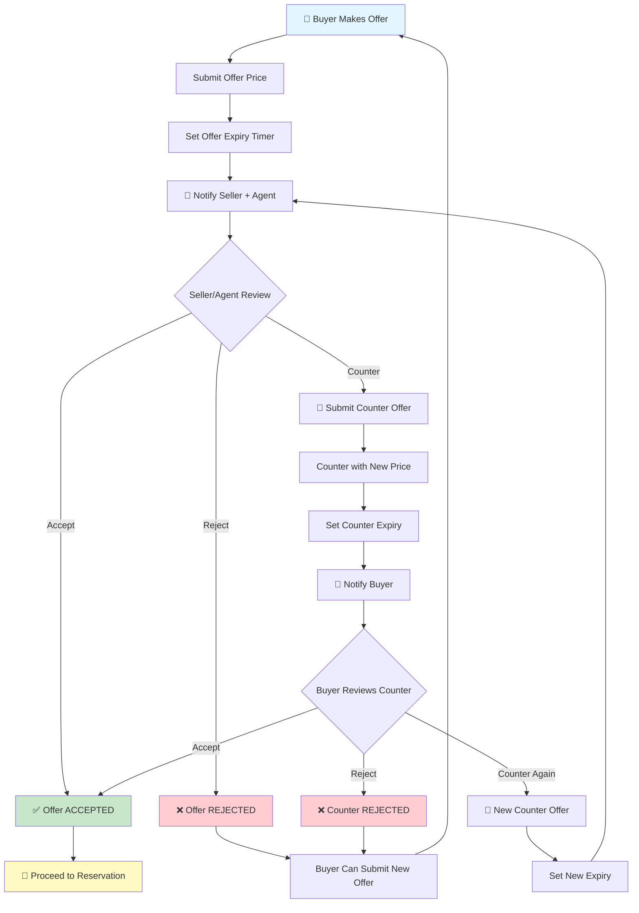

**Negotiation Rules:**
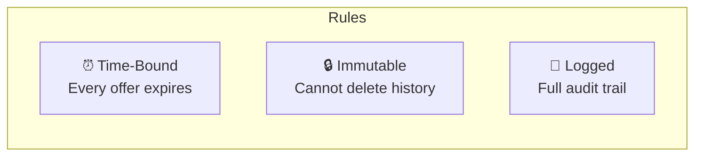

**Offer Status Lifecycle:**
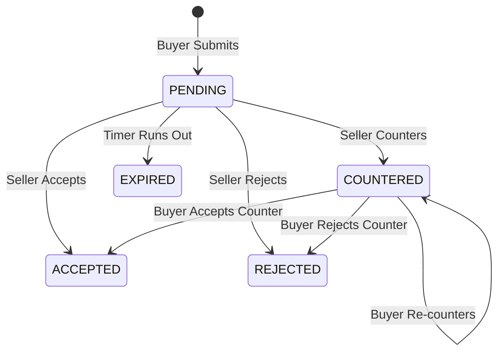

---

## 7. RESERVATION WORKFLOW (0.1% TOKEN)

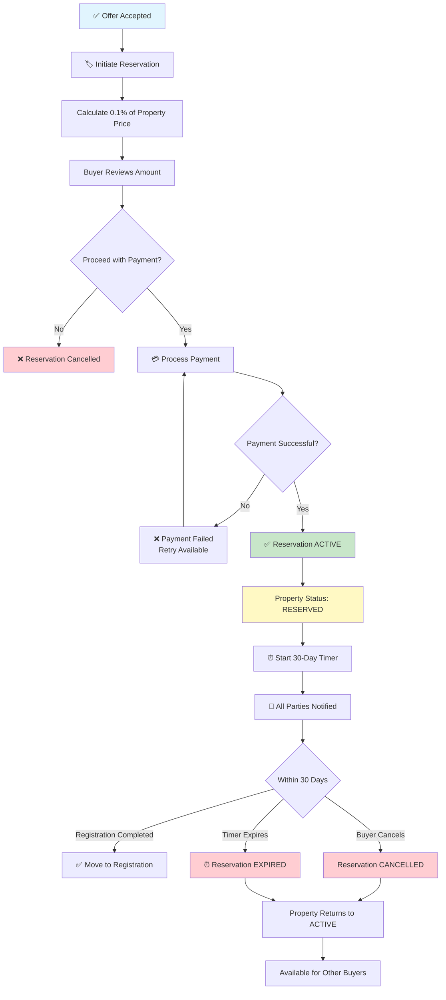

**Reservation Timeline:**
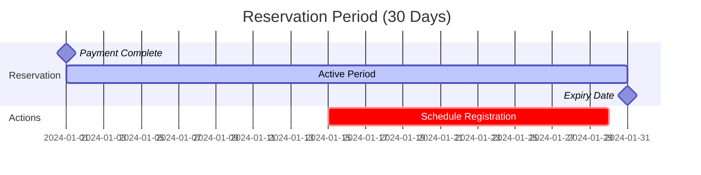

---

## 8. REGISTRATION & TRANSACTION WORKFLOW

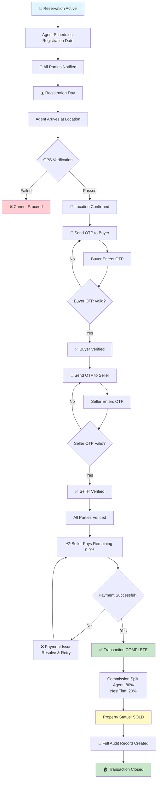

**Commission Flow:**
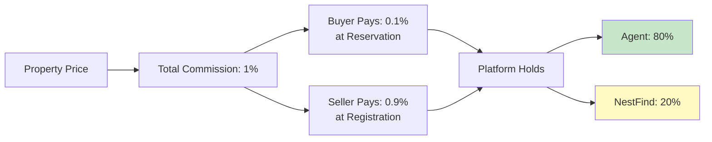

---

## 9. COMPLETE TRANSACTION STATE MACHINE

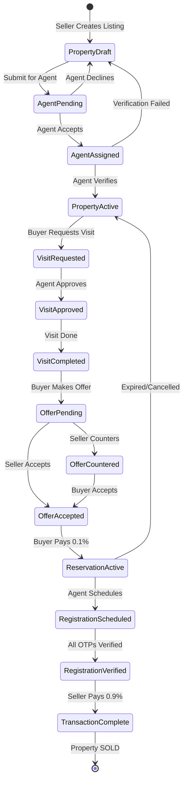

---

## 10. SYSTEM ARCHITECTURE OVERVIEW

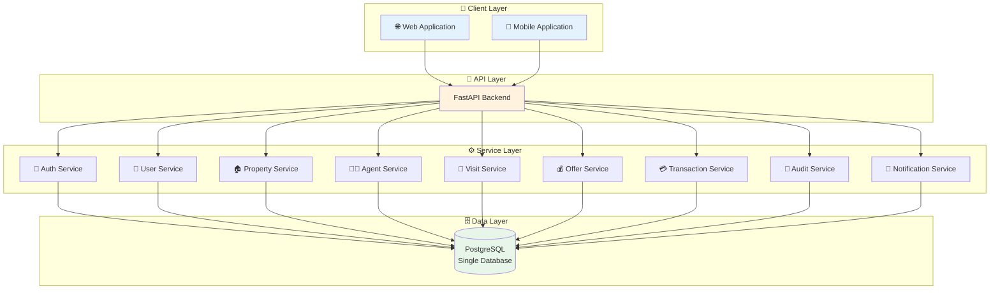

---

## 11. DATABASE ENTITY RELATIONSHIP

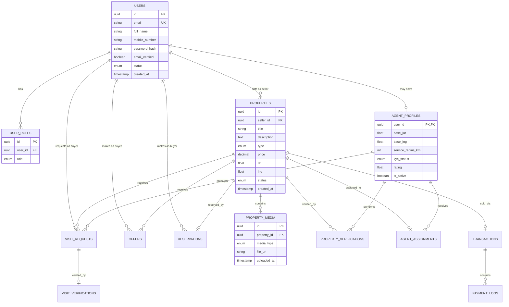

---

## 12. TRUST & SECURITY MECHANISMS

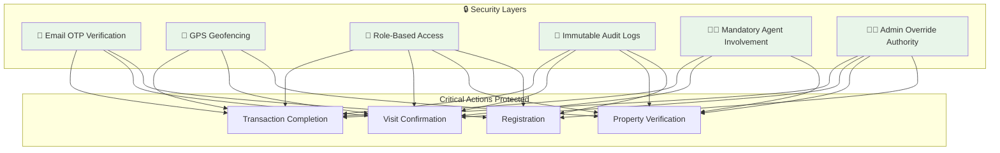

---

## 13. DISPUTE RESOLUTION WORKFLOW

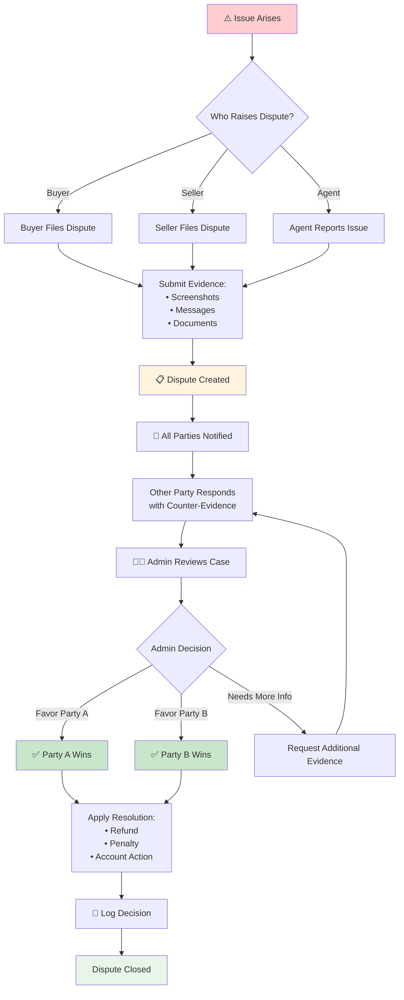

---

## Quick Reference: All Status Flows

| Entity | Status Flow |
|--------|-------------|
| **User** | `PENDING_VERIFICATION` → `ACTIVE` / `SUSPENDED` |
| **Agent** | `PENDING_VERIFICATION` → `UNDER_REVIEW` → `APPROVED`/`DECLINED` → `ACTIVE` |
| **Property** | `DRAFT` → `ACTIVE` → `RESERVED` → `SOLD` |
| **Visit** | `REQUESTED` → `APPROVED` → `COMPLETED` |
| **Offer** | `PENDING` → `ACCEPTED`/`REJECTED`/`COUNTERED` → `EXPIRED` |
| **Reservation** | `ACTIVE` → `EXPIRED`/`CANCELLED`/`COMPLETED` |
| **Transaction** | `INITIATED` → `VERIFIED` → `COMPLETED` |

---

> **Document Version:** 1.0  
> **Last Updated:** December 18, 2024  
> **Purpose:** Source of Truth for NestFind Development
