# 📊 NESTFIND — VISUAL WORKFLOW DIAGRAMS

*Complete visual representation of all business workflows and system flows*

---

## 1. USER REGISTRATION WORKFLOW (BUYER / SELLER)

```mermaid
flowchart TD
    A[👤 User Opens Registration] --> B[Fill Registration Form]
    B --> C{Validate Input}
    C -->|Invalid| B
    C -->|Valid| D[Create User Record<br/>status: PENDING_VERIFICATION]
    D --> E[Generate Email OTP]
    E --> F[📧 Send OTP to Email]
    F --> G[User Enters OTP]
    G --> H{Verify OTP}
    H -->|Invalid/Expired| I{Attempts < 5?}
    I -->|Yes| G
    I -->|No| J[❌ Block & Require New OTP]
    J --> E
    H -->|Valid| K[✅ Account ACTIVE]
    K --> L[🏠 User Can Browse/Buy/Sell]

    style A fill:#e1f5fe
    style K fill:#c8e6c9
    style J fill:#ffcdd2
    style L fill:#fff9c4
```

**Key Points:**
- Single registration for both Buyer & Seller
- Email OTP verification only (no SMS)
- Role assigned based on user actions (list = Seller, offer = Buyer)

---

## 2. AGENT REGISTRATION WORKFLOW

```mermaid
flowchart TD
    A[🧑‍💼 Agent Opens Registration] --> B[Fill Basic User Details]
    B --> C[Fill Agent-Specific Details<br/>• Address<br/>• ID Documents<br/>• Base Location lat/lng<br/>• Service Radius ≤100km]
    C --> D{Validate All Fields}
    D -->|Invalid| C
    D -->|Valid| E[Create User Record<br/>status: PENDING_VERIFICATION]
    E --> F[📧 Send Email OTP]
    F --> G[Agent Verifies OTP]
    G --> H{OTP Valid?}
    H -->|No| I[Retry or Resend]
    I --> F
    H -->|Yes| J[Agent Status: UNDER_REVIEW]
    J --> K[📋 Admin Notified]
    K --> L{Admin Reviews Application}
    L -->|Approve| M[✅ Agent Status: ACTIVE]
    L -->|Decline| N[❌ Status: DECLINED<br/>+ Reason Provided]
    N --> O{Agent Wants to Reapply?}
    O -->|Yes| P[Edit Application Details]
    P --> Q[Resubmit for Review]
    Q --> L
    O -->|No| R[Application Closed]
    M --> S[🎯 Agent Can Take Cases]

    style A fill:#e1f5fe
    style M fill:#c8e6c9
    style N fill:#ffcdd2
    style S fill:#fff9c4
```

**Agent Status Lifecycle:**

---

## 3. PROPERTY LISTING WORKFLOW (SELLER)

```mermaid
flowchart TD
    A[🏠 Seller Creates Property] --> B[Enter Property Details<br/>• Title, Description<br/>• Type, Price<br/>• Location lat/lng]
    B --> C[📸 Upload Images/Videos]
    C --> D[Property Status: DRAFT]
    D --> E{Property Complete?}
    E -->|No| B
    E -->|Yes| F[🧑‍💼 Must Hire Agent]
    F --> G[View Nearby Agents<br/>Within 100km radius]
    G --> H[Select Agent]
    H --> I[Send Assignment Request]
    I --> J{Agent Response}
    J -->|Decline| G
    J -->|Accept| K[Agent Assigned]
    K --> L[📍 Agent Visits Property]
    L --> M[Agent Verifies:<br/>• Location GPS<br/>• Photos/Videos<br/>• Document Check]
    M --> N{Verification Passed?}
    N -->|No| O[❌ Request Corrections]
    O --> B
    N -->|Yes| P[✅ Property Status: ACTIVE]
    P --> Q[🌐 Visible to All Buyers]

    style A fill:#e1f5fe
    style D fill:#fff3e0
    style P fill:#c8e6c9
    style Q fill:#fff9c4
```

**Property Status Lifecycle:**

---

## 4. AGENT ASSIGNMENT WORKFLOW

```mermaid
flowchart TD
    A[🏠 Seller Needs Agent] --> B[Open Agent Discovery]
    B --> C[🗺️ Map/List View<br/>Filter: within 100km]
    C --> D[View Agent Cards:<br/>• Distance<br/>• Rating<br/>• Completed Deals<br/>• Specialization]
    D --> E[Select Preferred Agent]
    E --> F[Send Assignment Request]
    F --> G[📧 Agent Receives Notification]
    G --> H{Agent Reviews Case}
    H --> I{Distance Check}
    I -->|>100km| J[❌ Auto-Reject]
    I -->|≤100km| K[Calculate SLA:<br/>0-20km: 24hrs<br/>20-50km: 48hrs<br/>50-100km: 72hrs]
    K --> L{Agent Decision}
    L -->|Accept| M[✅ Assignment ACTIVE]
    L -->|Decline| N[❌ Notify Seller]
    N --> C
    J --> N
    M --> O[Agent Commits to SLA]
    O --> P[🎯 Case Begins]

    style A fill:#e1f5fe
    style M fill:#c8e6c9
    style J fill:#ffcdd2
    style N fill:#ffcdd2
```

**Distance-Based SLA Table:**
| Distance | Max Visit Time | Priority |
|----------|---------------|----------|
| 0-20 km  | 24 hours      | High     |
| 20-50 km | 48 hours      | Medium   |
| 50-100 km| 72 hours      | Standard |

---

## 5. PROPERTY VISIT WORKFLOW (BUYER)

```mermaid
flowchart TD
    A[👤 Buyer Views Property] --> B[Request Visit Slot]
    B --> C[Select Preferred Date/Time]
    C --> D[📧 Agent Receives Request]
    D --> E{Agent Reviews}
    E -->|Reject| F[❌ Notify Buyer<br/>Suggest Alternative]
    F --> C
    E -->|Approve| G[✅ Visit Scheduled]
    G --> H[📧 Both Parties Notified]
    
    H --> I[🗓️ Visit Day]
    I --> J[Agent Arrives at Property]
    J --> K{GPS Verification}
    K -->|Outside Geofence| L[❌ Cannot Proceed]
    K -->|Inside 50-100m| M[📍 Location Confirmed]
    M --> N[📧 Email OTP to Agent]
    N --> O[Agent Enters OTP]
    O --> P{OTP Valid?}
    P -->|No| N
    P -->|Yes| Q[Visit Check-in Complete]
    Q --> R[🏠 Property Tour with Buyer]
    R --> S[Agent Uploads:<br/>• Timestamped Photos<br/>• Visit Notes]
    S --> T[✅ Visit Status: COMPLETED]
    T --> U[📝 Logged in Audit Trail]

    style A fill:#e1f5fe
    style G fill:#c8e6c9
    style L fill:#ffcdd2
    style T fill:#c8e6c9
    style U fill:#fff9c4
```

**Visit Status Lifecycle:**

---

## 6. OFFER & NEGOTIATION WORKFLOW

```mermaid
flowchart TD
    A[👤 Buyer Makes Offer] --> B[Submit Offer Price]
    B --> C[Set Offer Expiry Timer]
    C --> D[📧 Notify Seller + Agent]
    D --> E{Seller/Agent Review}
    
    E -->|Accept| F[✅ Offer ACCEPTED]
    E -->|Reject| G[❌ Offer REJECTED]
    E -->|Counter| H[📝 Submit Counter Offer]
    
    H --> I[Counter with New Price]
    I --> J[Set Counter Expiry]
    J --> K[📧 Notify Buyer]
    K --> L{Buyer Reviews Counter}
    
    L -->|Accept| F
    L -->|Reject| M[❌ Counter REJECTED]
    L -->|Counter Again| N[📝 New Counter Offer]
    N --> O[Set New Expiry]
    O --> D
    
    G --> P[Buyer Can Submit New Offer]
    M --> P
    P --> A
    
    F --> Q[🎯 Proceed to Reservation]

    style A fill:#e1f5fe
    style F fill:#c8e6c9
    style G fill:#ffcdd2
    style M fill:#ffcdd2
    style Q fill:#fff9c4
```

**Negotiation Rules:**
```mermaid
flowchart LR
    subgraph Rules
        A[⏰ Time-Bound<br/>Every offer expires] 
        B[🔒 Immutable<br/>Cannot delete history]
        C[📝 Logged<br/>Full audit trail]
    end
```

**Offer Status Lifecycle:**

---

## 7. RESERVATION WORKFLOW (0.1% TOKEN)

```mermaid
flowchart TD
    A[✅ Offer Accepted] --> B[🏷️ Initiate Reservation]
    B --> C[Calculate 0.1% of Property Price]
    C --> D[Buyer Reviews Amount]
    D --> E{Proceed with Payment?}
    E -->|No| F[❌ Reservation Cancelled]
    E -->|Yes| G[💳 Process Payment]
    G --> H{Payment Successful?}
    H -->|No| I[❌ Payment Failed<br/>Retry Available]
    I --> G
    H -->|Yes| J[✅ Reservation ACTIVE]
    J --> K[Property Status: RESERVED]
    K --> L[⏰ Start 30-Day Timer]
    L --> M[📧 All Parties Notified]
    M --> N{Within 30 Days}
    
    N -->|Registration Completed| O[✅ Move to Registration]
    N -->|Buyer Cancels| P[Reservation CANCELLED]
    N -->|Timer Expires| Q[⏰ Reservation EXPIRED]
    
    P --> R[Property Returns to ACTIVE]
    Q --> R
    R --> S[Available for Other Buyers]

    style A fill:#e1f5fe
    style J fill:#c8e6c9
    style K fill:#fff9c4
    style F fill:#ffcdd2
    style P fill:#ffcdd2
    style Q fill:#ffcdd2
```

**Reservation Timeline:**

---

## 8. REGISTRATION & TRANSACTION WORKFLOW

```mermaid
flowchart TD
    A[📅 Reservation Active] --> B[Agent Schedules Registration Date]
    B --> C[📧 All Parties Notified]
    C --> D[🗓️ Registration Day]
    
    D --> E[Agent Arrives at Location]
    E --> F{GPS Verification}
    F -->|Failed| G[❌ Cannot Proceed]
    F -->|Passed| H[📍 Location Confirmed]
    
    H --> I[📧 Send OTP to Buyer]
    I --> J[Buyer Enters OTP]
    J --> K{Buyer OTP Valid?}
    K -->|No| I
    K -->|Yes| L[✅ Buyer Verified]
    
    L --> M[📧 Send OTP to Seller]
    M --> N[Seller Enters OTP]
    N --> O{Seller OTP Valid?}
    O -->|No| M
    O -->|Yes| P[✅ Seller Verified]
    
    P --> Q[All Parties Verified]
    Q --> R[💳 Seller Pays Remaining 0.9%]
    R --> S{Payment Successful?}
    S -->|No| T[❌ Payment Issue<br/>Resolve & Retry]
    T --> R
    S -->|Yes| U[✅ Transaction COMPLETE]
    
    U --> V[Commission Split:<br/>Agent: 80%<br/>NestFind: 20%]
    V --> W[Property Status: SOLD]
    W --> X[📝 Full Audit Record Created]
    X --> Y[🏠 Transaction Closed]

    style A fill:#e1f5fe
    style U fill:#c8e6c9
    style W fill:#fff9c4
    style G fill:#ffcdd2
    style Y fill:#c8e6c9
```

**Commission Flow:**

---

## 9. COMPLETE TRANSACTION STATE MACHINE

---

## 10. SYSTEM ARCHITECTURE OVERVIEW

```mermaid
flowchart TB
    subgraph Clients["📱 Client Layer"]
        WEB[🌐 Web Application]
        MOB[📱 Mobile Application]
    end
    
    subgraph API["🔌 API Layer"]
        FAST[FastAPI Backend]
    end
    
    subgraph Services["⚙️ Service Layer"]
        AUTH[🔐 Auth Service]
        USER[👤 User Service]
        PROP[🏠 Property Service]
        AGENT[🧑‍💼 Agent Service]
        VISIT[📅 Visit Service]
        OFFER[💰 Offer Service]
        TRANS[💳 Transaction Service]
        AUDIT[📝 Audit Service]
        NOTIF[📧 Notification Service]
    end
    
    subgraph Data["🗄️ Data Layer"]
        DB[(PostgreSQL<br/>Single Database)]
    end
    
    WEB --> FAST
    MOB --> FAST
    FAST --> AUTH
    FAST --> USER
    FAST --> PROP
    FAST --> AGENT
    FAST --> VISIT
    FAST --> OFFER
    FAST --> TRANS
    FAST --> AUDIT
    FAST --> NOTIF
    
    AUTH --> DB
    USER --> DB
    PROP --> DB
    AGENT --> DB
    VISIT --> DB
    OFFER --> DB
    TRANS --> DB
    AUDIT --> DB
    NOTIF --> DB

    style WEB fill:#e3f2fd
    style MOB fill:#e3f2fd
    style FAST fill:#fff3e0
    style DB fill:#e8f5e9
```

---

## 11. DATABASE ENTITY RELATIONSHIP

---

## 12. TRUST & SECURITY MECHANISMS

```mermaid
flowchart TD
    subgraph SecurityLayers["🔒 Security Layers"]
        A[📧 Email OTP Verification]
        B[📍 GPS Geofencing]
        C[🔐 Role-Based Access]
        D[📝 Immutable Audit Logs]
        E[🧑‍💼 Mandatory Agent Involvement]
        F[👨‍💻 Admin Override Authority]
    end
    
    subgraph Actions["Critical Actions Protected"]
        G[Registration]
        H[Property Verification]
        I[Visit Confirmation]
        J[Transaction Completion]
    end
    
    A --> G
    A --> I
    A --> J
    B --> H
    B --> I
    B --> J
    C --> G
    C --> H
    C --> I
    C --> J
    D --> G
    D --> H
    D --> I
    D --> J
    E --> H
    E --> I
    E --> J
    F --> G
    F --> H
    F --> I
    F --> J

    style A fill:#e8f5e9
    style B fill:#e8f5e9
    style C fill:#e8f5e9
    style D fill:#e8f5e9
    style E fill:#e8f5e9
    style F fill:#e8f5e9
```

---

## 13. DISPUTE RESOLUTION WORKFLOW

```mermaid
flowchart TD
    A[⚠️ Issue Arises] --> B{Who Raises Dispute?}
    
    B -->|Buyer| C[Buyer Files Dispute]
    B -->|Seller| D[Seller Files Dispute]
    B -->|Agent| E[Agent Reports Issue]
    
    C --> F[Submit Evidence:<br/>• Screenshots<br/>• Messages<br/>• Documents]
    D --> F
    E --> F
    
    F --> G[📋 Dispute Created]
    G --> H[📧 All Parties Notified]
    H --> I[Other Party Responds<br/>with Counter-Evidence]
    I --> J[👨‍💻 Admin Reviews Case]
    
    J --> K{Admin Decision}
    K -->|Favor Party A| L[✅ Party A Wins]
    K -->|Favor Party B| M[✅ Party B Wins]
    K -->|Needs More Info| N[Request Additional Evidence]
    N --> I
    
    L --> O[Apply Resolution:<br/>• Refund<br/>• Penalty<br/>• Account Action]
    M --> O
    O --> P[📝 Log Decision]
    P --> Q[Dispute Closed]

    style A fill:#ffcdd2
    style G fill:#fff3e0
    style L fill:#c8e6c9
    style M fill:#c8e6c9
    style Q fill:#e8f5e9
```

---

## Quick Reference: All Status Flows

| Entity | Status Flow |
|--------|-------------|
| **User** | `PENDING_VERIFICATION` → `ACTIVE` / `SUSPENDED` |
| **Agent** | `PENDING_VERIFICATION` → `UNDER_REVIEW` → `APPROVED`/`DECLINED` → `ACTIVE` |
| **Property** | `DRAFT` → `ACTIVE` → `RESERVED` → `SOLD` |
| **Visit** | `REQUESTED` → `APPROVED` → `COMPLETED` |
| **Offer** | `PENDING` → `ACCEPTED`/`REJECTED`/`COUNTERED` → `EXPIRED` |
| **Reservation** | `ACTIVE` → `EXPIRED`/`CANCELLED`/`COMPLETED` |
| **Transaction** | `INITIATED` → `VERIFIED` → `COMPLETED` |

---

> **Document Version:** 1.0  
> **Last Updated:** December 18, 2024  
> **Purpose:** Source of Truth for NestFind Development
