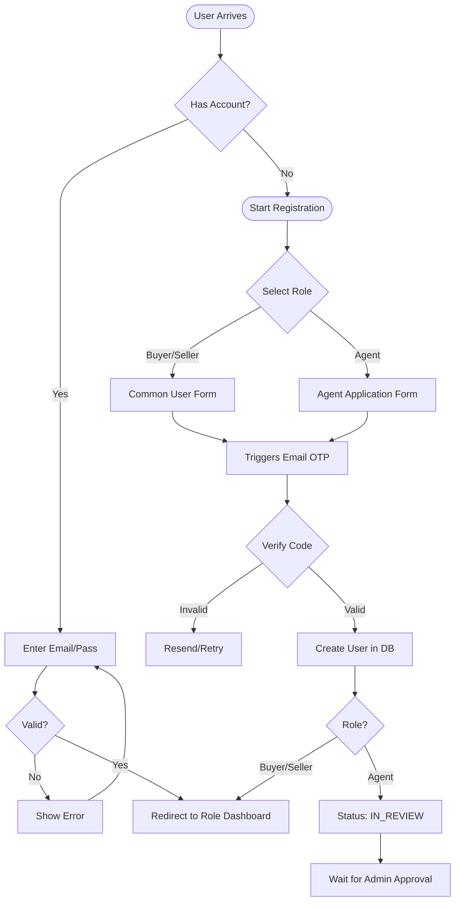
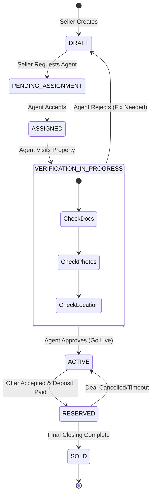
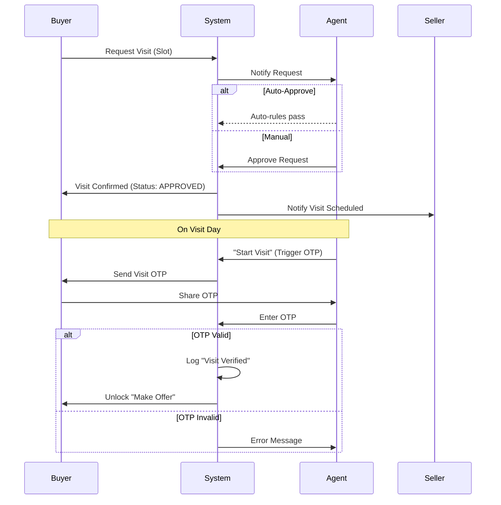
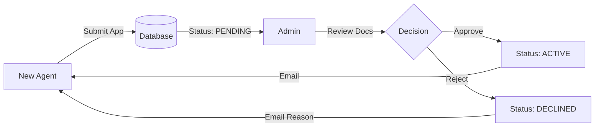

# NestFind - Visual Workflow Diagrams

> **Visualizing the "Trust-First" & "State-Based" Flows**

---

## 1. User Authentication & Registration



---

## 2. Property Lifecycle (The "Trust" Chain)



---

## 3. Visit Booking & Execution



---

## 4. Offer & Negotiation Flow

```mermaid
flowchart TD
    start([Buyer Makes Offer]) --> check{Visit Verified?}
    check -- No --> block[Block: "Must Visit First"]
    check -- Yes --> submit[Submit Offer details]
    
    submit --> status_pend[Status: PENDING]
    status_pend --> notify_seller[Notify Seller & Agent]
    
    notify_seller --> decision{Seller Action}
    
    decision -- Accept --> status_accept[Status: ACCEPTED]
    decision -- Reject --> status_reject[Status: REJECTED] --> end_flow([End])
    decision -- Counter --> status_counter[Status: COUNTERED]
    
    status_counter --> buyer_dec{Buyer Action}
    buyer_dec -- Accept Counter --> status_accept
    buyer_dec -- Reject --> end_flow
    buyer_dec -- Counter Back --> status_pend
    
    status_accept --> timer[Start Reservation Timer]
    timer --> pay{Deposit Paid?}
    
    pay -- Yes --> reserved[Prop Status: RESERVED]
    pay -- No/Timeout --> expired[Offer Expired] --> status_pend
```

---

## 5. Agent Onboarding & Approval (Admin)


