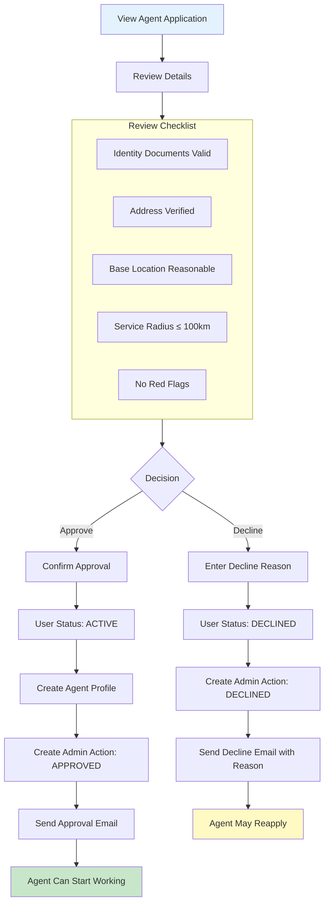
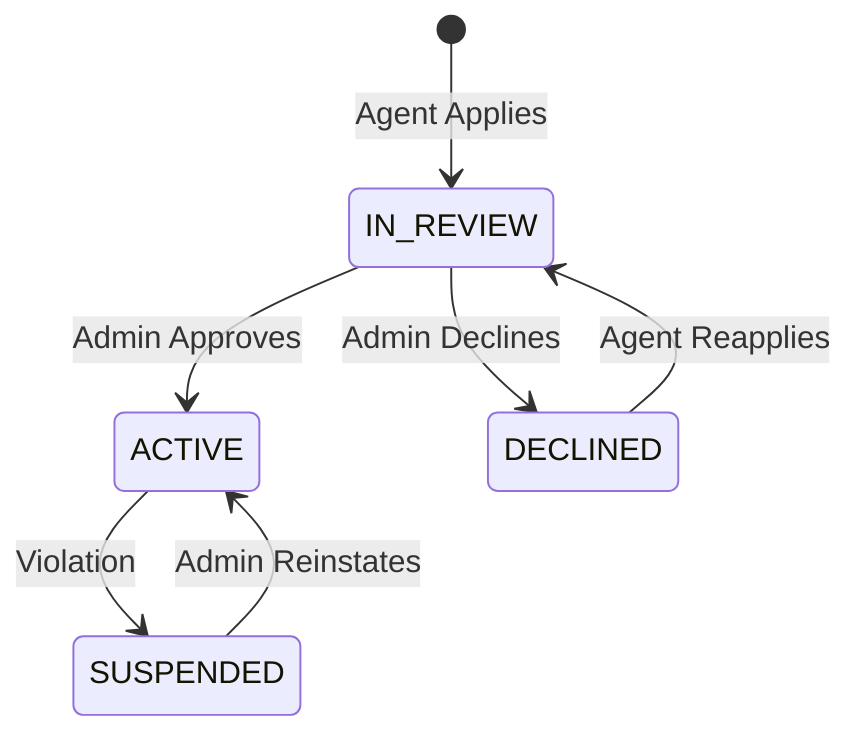

# Admin Agent Approval Workflow

Review and approve/decline agent applications.

---

## Flow Diagram

---

## State Diagram

---

## State Transitions

| Entity | From | To | Trigger |
|--------|------|-----|---------|
| users | IN_REVIEW | ACTIVE | Admin approves |
| users | IN_REVIEW | DECLINED | Admin declines |
| users | DECLINED | IN_REVIEW | Agent reapplies |
| agent_profiles | - | CREATED | Approval |
| admin_actions | - | AGENT_APPROVED | Approval |
| admin_actions | - | AGENT_DECLINED | Decline |
| audit_logs | - | ADMIN_APPROVE_AGENT | Approval |
| audit_logs | - | ADMIN_DECLINE_AGENT | Decline |

---

## Key Points

- Decline reason is mandatory
- Declined agents can reapply
- Old applications are kept for audit
- Approval creates agent_profile record
- All decisions are audited
