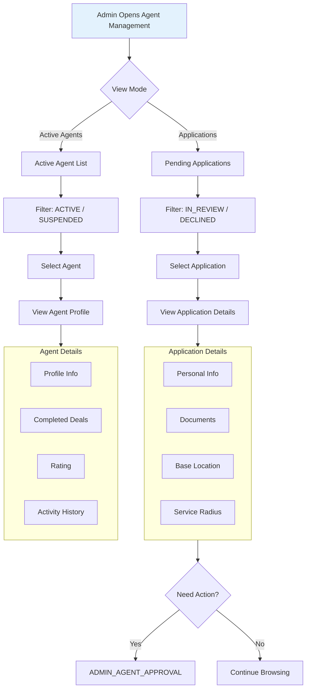

# Admin Agent Overview Workflow

View agent applications and profiles without making changes.

---

## Flow Diagram

---

## Key Points

- Read-only workflow
- Separates applications from active agents
- No state changes occur
- Provides data for approval decisions
