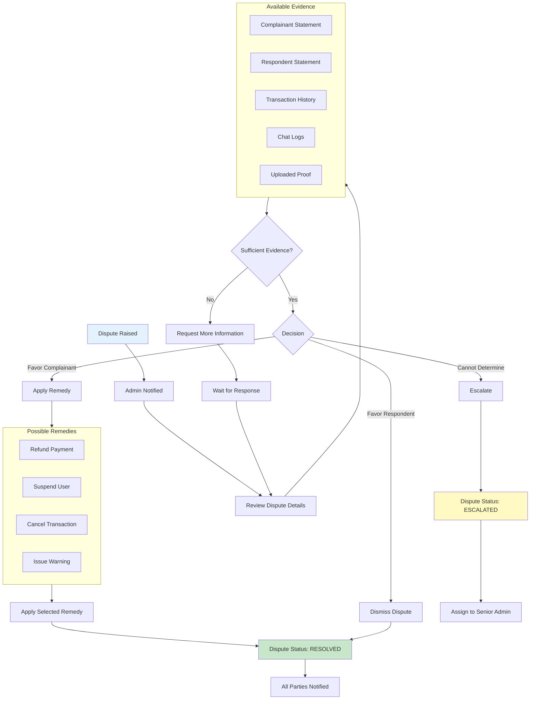
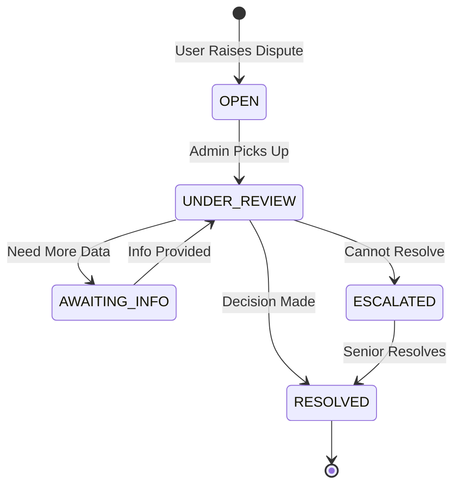

# Admin Dispute Resolution Workflow

Review and resolve disputes between platform users.

---

## Flow Diagram

---

## State Diagram

---

## State Transitions

| Entity | From | To | Trigger |
|--------|------|-----|---------|
| disputes | OPEN | UNDER_REVIEW | Admin starts review |
| disputes | UNDER_REVIEW | RESOLVED | Decision made |
| disputes | UNDER_REVIEW | ESCALATED | Cannot resolve |
| admin_actions | - | DISPUTE_RESOLVED | Resolution |
| audit_logs | - | ADMIN_DISPUTE_ACTION | Any action |

---

## Key Points

- All evidence is immutable
- Decision reason is mandatory
- Both parties are notified of outcome
- Escalation goes to senior admin
- Remedies can affect multiple entities
