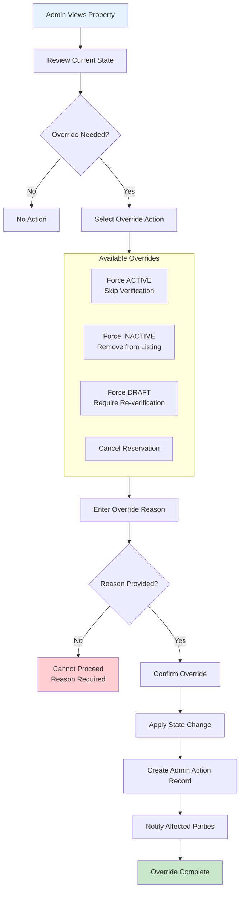

# Admin Property Override Workflow

Force property state changes when normal workflow cannot proceed.

---

## Flow Diagram

---

## State Transitions

| Entity | From | To | Trigger |
|--------|------|-----|---------|
| properties | PENDING_VERIFY | ACTIVE | Admin force approve |
| properties | ACTIVE | INACTIVE | Admin deactivate |
| properties | * | DRAFT | Admin force reset |
| properties | RESERVED | ACTIVE | Admin cancel reservation |
| admin_actions | - | PROPERTY_OVERRIDE | Any override |
| audit_logs | - | ADMIN_PROPERTY_OVERRIDE | Override action |

---

## Key Points

- Reason is always mandatory
- All overrides create permanent record
- Affected parties are always notified
- Overrides bypass normal workflows
- Cannot override to SOLD (requires transaction)
