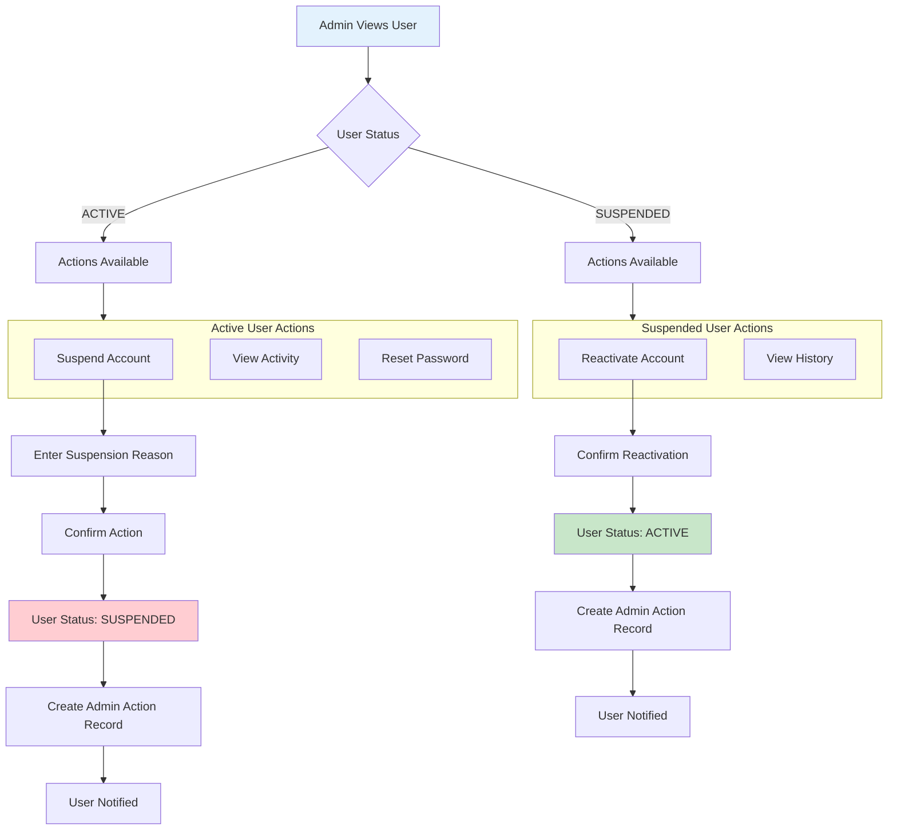
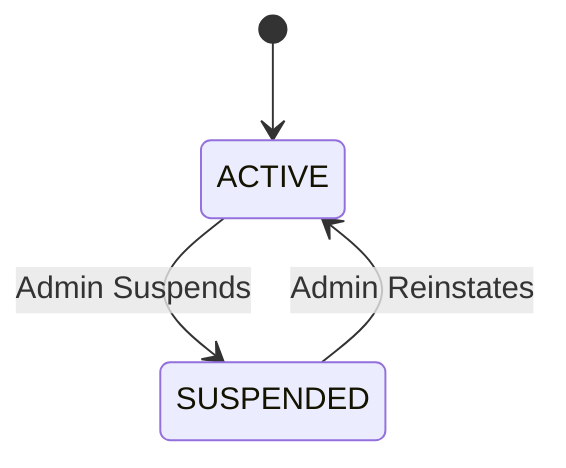

# Admin User Control Workflow

Suspend, activate, and manage user accounts with full audit trail.

---

## Flow Diagram

---

## State Diagram

---

## State Transitions

| Entity | From | To | Trigger |
|--------|------|-----|---------|
| users | ACTIVE | SUSPENDED | Admin suspension |
| users | SUSPENDED | ACTIVE | Admin reactivation |
| admin_actions | - | USER_SUSPENDED | Suspension action |
| admin_actions | - | USER_ACTIVATED | Reactivation |
| audit_logs | - | ADMIN_SUSPEND_USER | Suspension |
| audit_logs | - | ADMIN_ACTIVATE_USER | Activation |

---

## Key Points

- Reason is mandatory for suspension
- All actions create admin_action record
- User is notified of status change
- Suspended users cannot log in
- Admin cannot delete users (only suspend)
