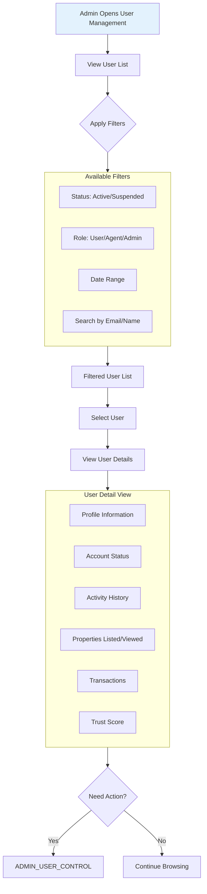

# Admin User Overview Workflow

View and analyze user data without making changes.

---

## Flow Diagram

---

## Key Points

- Read-only workflow
- No state changes occur
- No audit log created for views
- Filters are applied server-side
- Sensitive data masked appropriately
