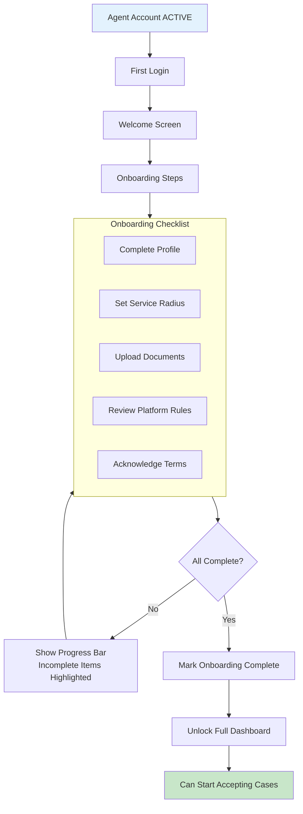
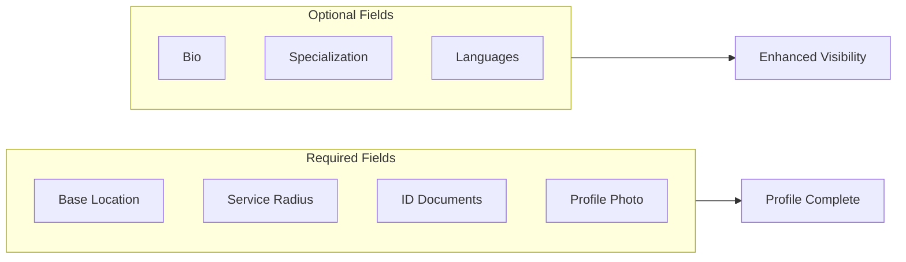

# Agent Onboarding Workflow

Guide newly approved agents through platform familiarization.

---

## Flow Diagram

---

## Agent Profile Completion

---

## Key Points

- Onboarding is guided but not blocking
- Agents can skip but get reminders
- Incomplete profiles have lower visibility
- Terms acknowledgment is mandatory
