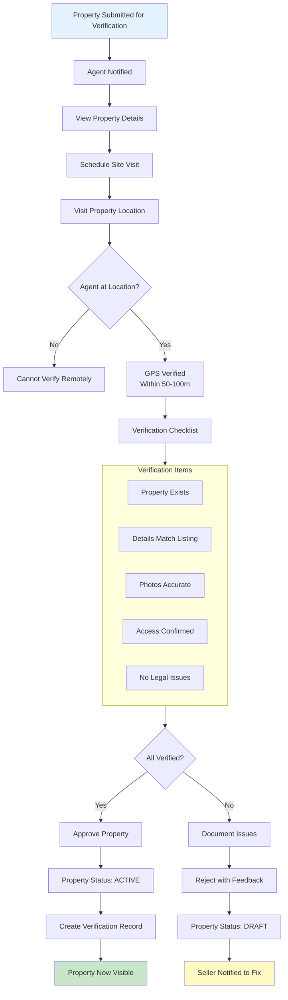
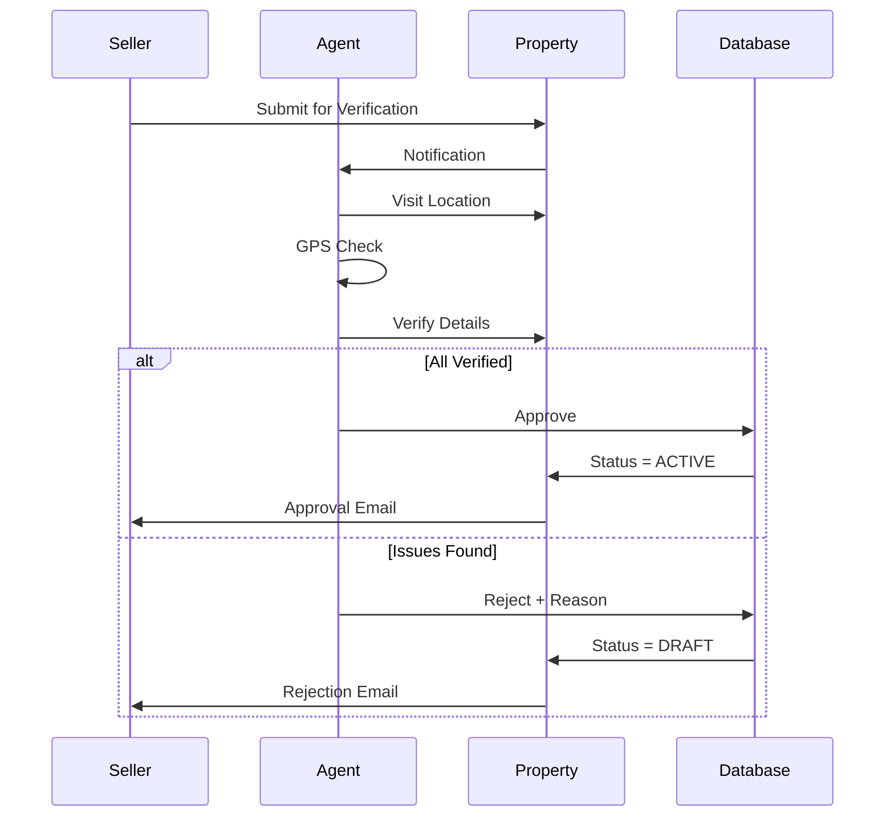

# Agent Property Verification Workflow

Verify property details on-site before making listing active.

---

## Flow Diagram

---

## Verification Sequence

---

## State Transitions

| Entity | From | To | Trigger |
|--------|------|-----|---------|
| properties | PENDING_VERIFY | ACTIVE | Agent approves |
| properties | PENDING_VERIFY | DRAFT | Agent rejects |
| property_verifications | - | CREATED | Verification complete |
| audit_logs | - | PROPERTY_VERIFIED | Approval |
| audit_logs | - | PROPERTY_REJECTED | Rejection |

---

## Key Points

- Agent must be physically present (GPS verified)
- Verification creates immutable record
- Rejected properties return to DRAFT
- Seller must fix issues and resubmit
- Verification data includes GPS coordinates and timestamp
