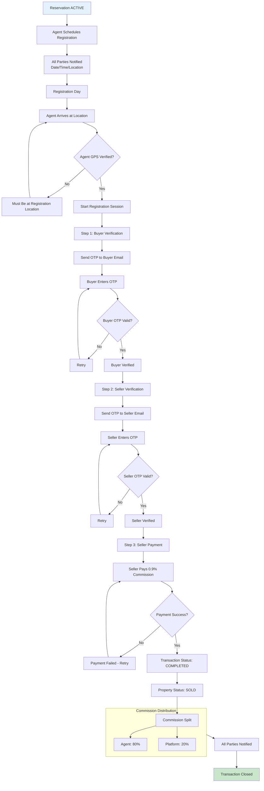
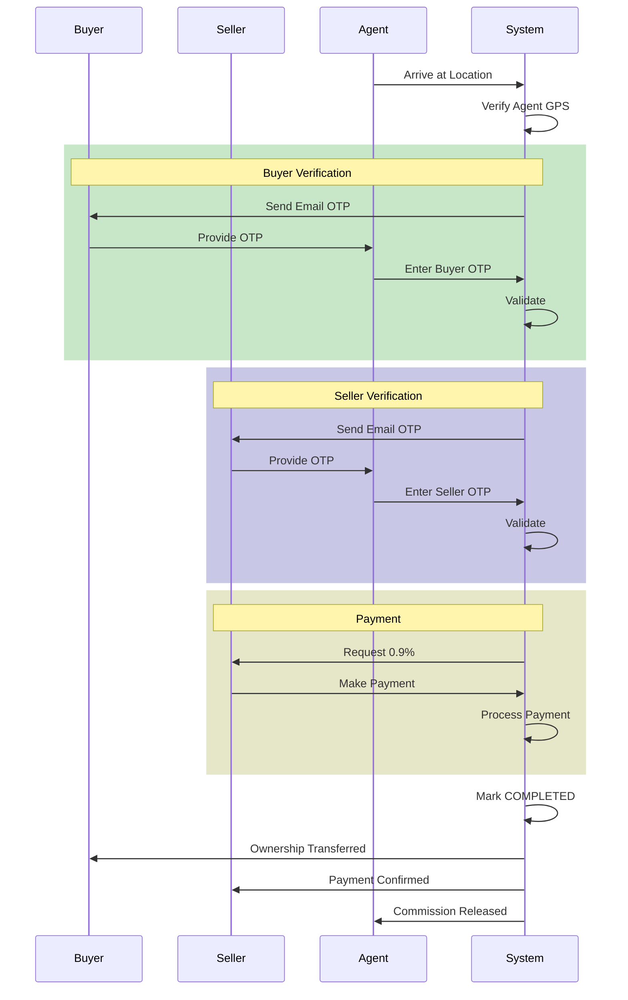
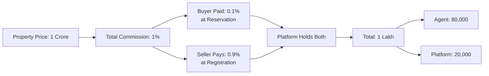

# Agent Registration Day Workflow

Facilitate property registration and transaction completion.

---

## Flow Diagram

---

## Registration Sequence

---

## Commission Flow

---

## State Transitions

| Entity | From | To | Trigger |
|--------|------|-----|---------|
| transactions | - | INITIATED | Registration starts |
| transactions | INITIATED | VERIFIED | Both OTPs valid |
| transactions | VERIFIED | COMPLETED | Payment success |
| properties | RESERVED | SOLD | Transaction complete |
| reservations | ACTIVE | COMPLETED | Transaction complete |
| payment_logs | - | COMPLETED | Seller payment |
| audit_logs | - | REGISTRATION_STARTED | Session begins |
| audit_logs | - | REGISTRATION_COMPLETED | Transaction done |

---

## Key Points

- Registration must happen within reservation period
- Agent GPS verification mandatory
- Buyer OTP verified first, then Seller
- Seller pays 0.9% at registration
- Commission auto-splits to agent and platform
- Property becomes SOLD (terminal state)
