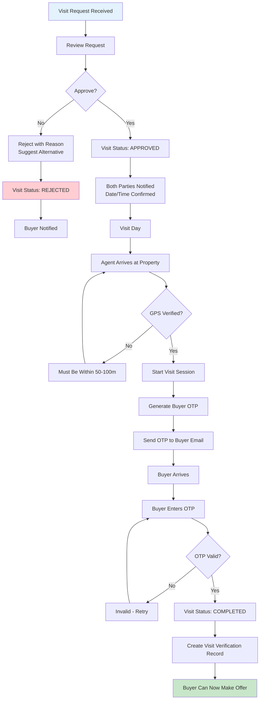
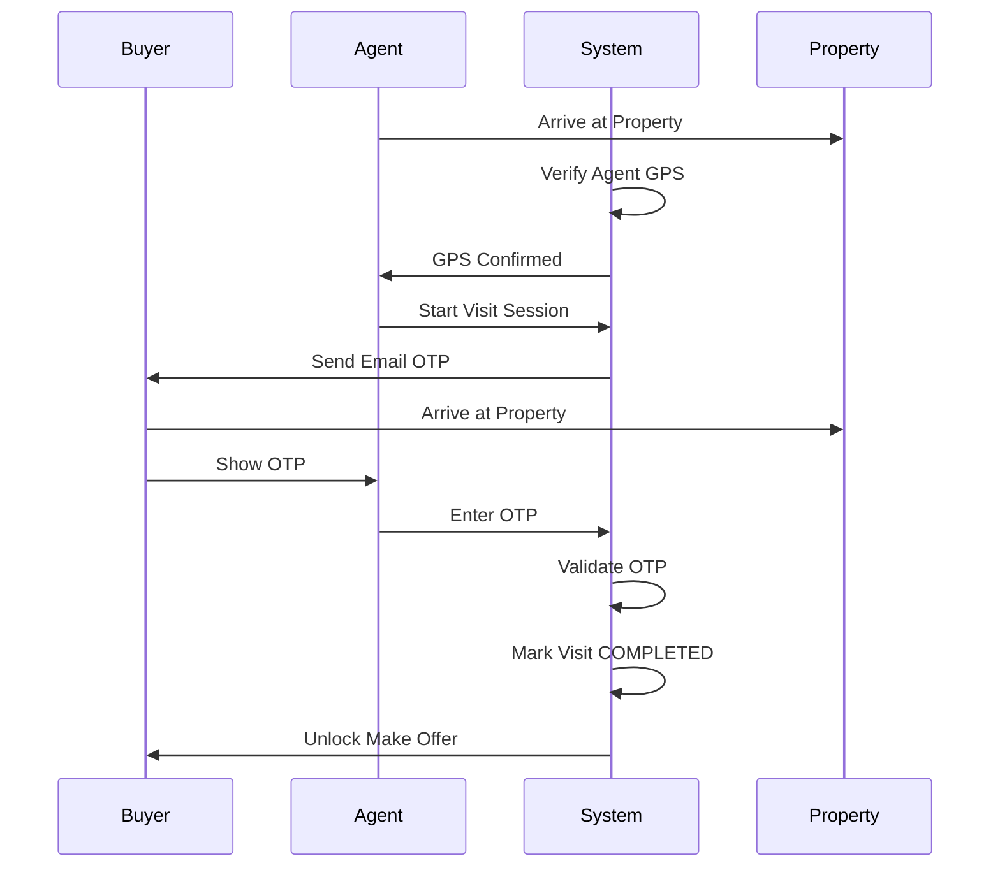

# Agent Visit Execution Workflow

Manage, conduct, and verify property visits.

---

## Flow Diagram

---

## Visit Verification Sequence

---

## State Transitions

| Entity | From | To | Trigger |
|--------|------|-----|---------|
| visit_requests | REQUESTED | APPROVED | Agent approves |
| visit_requests | REQUESTED | REJECTED | Agent rejects |
| visit_requests | APPROVED | COMPLETED | OTP verified |
| visit_requests | APPROVED | NO_SHOW | Buyer absent |
| visit_verifications | - | CREATED | Visit completed |
| audit_logs | - | VISIT_APPROVED | Approval |
| audit_logs | - | VISIT_COMPLETED | Completion |

---

## Key Points

- Agent must approve/reject within SLA
- GPS verification mandatory for agent
- OTP verification mandatory for buyer
- NO_SHOW affects buyer trust score
- Visit completion unlocks offer capability
