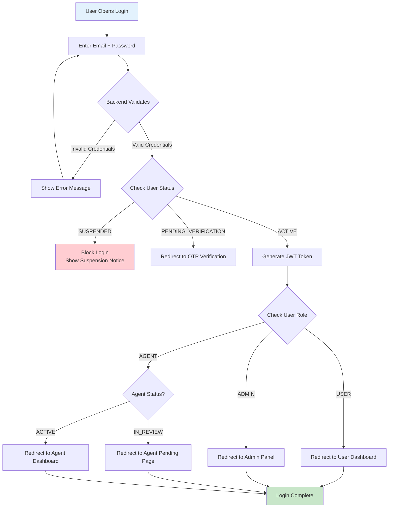
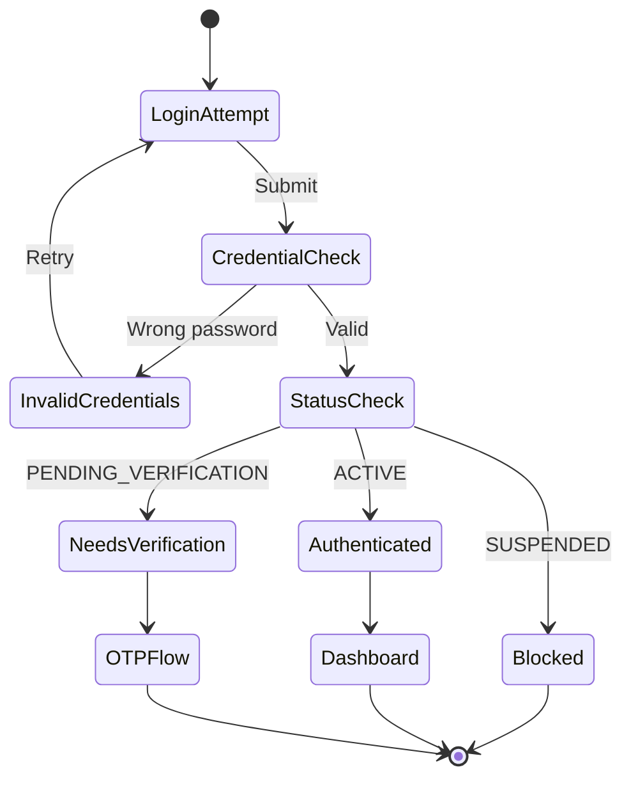

# Login Workflow

Allow authenticated access only when database state permits.

---

## Flow Diagram

---

## State Diagram

---

## State Transitions

| Entity | From | To | Trigger |
|--------|------|-----|---------|
| users | ACTIVE | ACTIVE | Successful login (no change) |
| sessions | - | CREATED | JWT token generated |
| audit_logs | - | LOGIN_SUCCESS | Valid credentials + ACTIVE status |
| audit_logs | - | LOGIN_FAILED | Invalid credentials |
| audit_logs | - | LOGIN_BLOCKED | SUSPENDED user attempt |

---

## Additional Security Audit Events

These events are logged for security monitoring but do not modify entity state:

- `LOGIN_RATE_LIMITED` - Login attempt blocked by rate limiter
- `OTP_REUSE_BLOCKED` - Same OTP attempted multiple times
- `TOKEN_REVOKED` - Session revoked via logout or admin action
- `SUSPICIOUS_ROLE_ACCESS` - Privilege escalation attempt detected
- `OTP_LOCKED` - Account locked after OTP failure threshold

---

## Critical Rules

- SUSPENDED users can NEVER log in
- IN_REVIEW agents can log in but see limited UI
- Admin role is determined from database, not claimed
- Every login attempt is logged (success or failure)
- JWT token contains user_id, role, status, session_id, and jti

---

## Security Rules

### Login Brute Force Protection
- 5 failed login attempts trigger 15-minute account lockout
- Login attempts counter resets on successful login

### JWT Session Binding
- JWT contains session_id linking to sessions table
- Tokens can be revoked via logout or admin action
- Every protected request checks sessions.revoked_at

### Role Re-Verification
- Role and status are re-verified from database for ALL privileged actions
- JWT role is for routing only, not authorization
- Critical endpoints (/admin/*, /agent/*/verify) require DB role check

### Agent Status Enforcement
- Agent endpoints require status=ACTIVE (not just role=AGENT)
- IN_REVIEW agents can only access profile and application status
- All other /agent/* endpoints forbidden for IN_REVIEW
