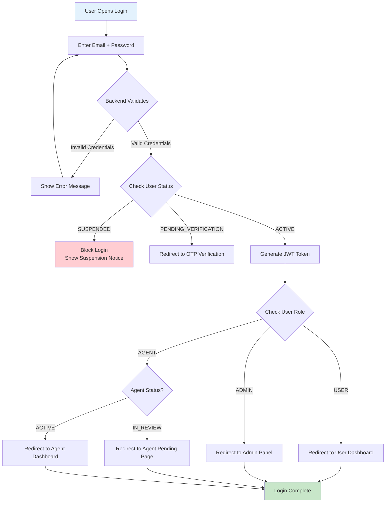
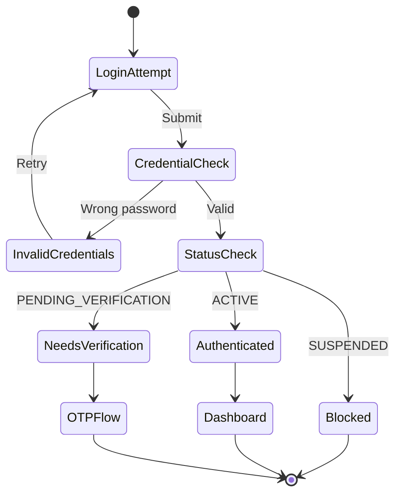

# Login Workflow

Allow authenticated access only when database state permits.

---

## Flow Diagram

---

## State Diagram

---

## State Transitions

| Entity | From | To | Trigger |
|--------|------|-----|---------|
| users | ACTIVE | ACTIVE | Successful login (no change) |
| audit_logs | - | LOGIN_SUCCESS | Valid credentials + ACTIVE status |
| audit_logs | - | LOGIN_FAILED | Invalid credentials |
| audit_logs | - | LOGIN_BLOCKED | SUSPENDED user attempt |

---

## Critical Rules

- SUSPENDED users can NEVER log in
- IN_REVIEW agents can log in but see limited UI
- Admin role is determined from database, not claimed
- Every login attempt is logged (success or failure)
- JWT token contains user_id, role, and expiry
