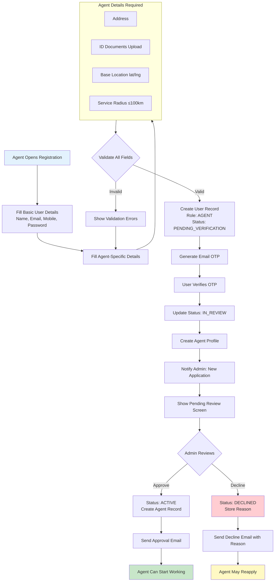
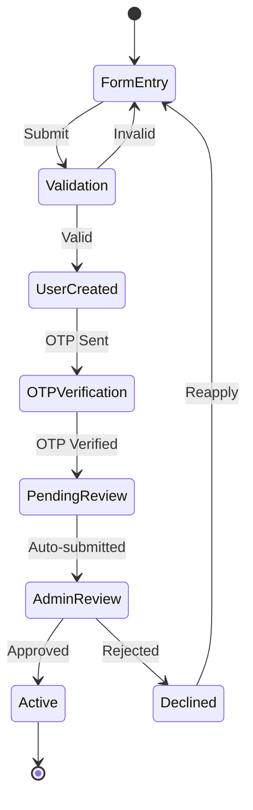
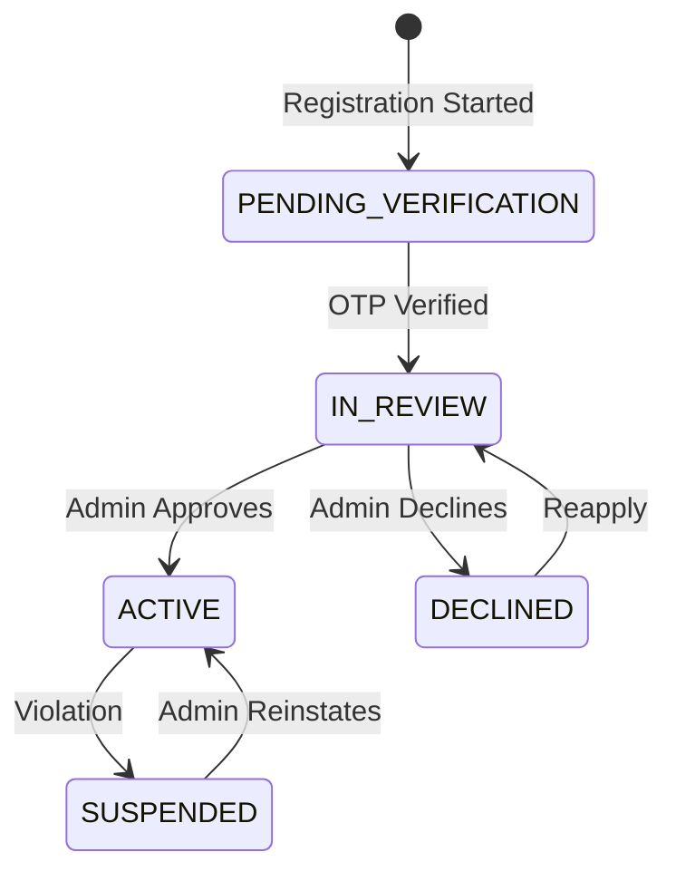

# Agent Signup Workflow

Create agent accounts with admin approval requirement to prevent fake agents and maintain platform trust.

---

## Flow Diagram

---

## State Diagram

---

## Agent User Status States

---

## State Transitions

| Entity | From | To | Trigger |
|--------|------|-----|---------|
| users | - | PENDING_VERIFICATION | Form submitted |
| users | PENDING_VERIFICATION | IN_REVIEW | OTP verified |
| users | IN_REVIEW | ACTIVE | Admin approves |
| users | IN_REVIEW | DECLINED | Admin declines |
| users | DECLINED | IN_REVIEW | Agent reapplies |
| agent_profiles | - | CREATED | OTP verified |
| admin_actions | - | AGENT_APPROVED | Admin approves |
| admin_actions | - | AGENT_DECLINED | Admin declines |
| audit_logs | - | AGENT_SIGNUP | Registration complete |
| audit_logs | - | AGENT_APPROVED | Admin approval |
| audit_logs | - | AGENT_DECLINED | Admin decline |

---

## Key Points

- Agents have separate registration flow from users
- Admin approval is mandatory before agent can operate
- IN_REVIEW agents can log in but have limited UI access
- DECLINED agents can edit details and reapply
- Old records are NEVER deleted (audit trail)
- Service radius cannot exceed 100km

---

## Security Rules

- Each OTP can only be used ONCE (single-use enforcement)
- Email cannot be changed until account is verified
- Password must be minimum 8 characters with 1 letter and 1 number
