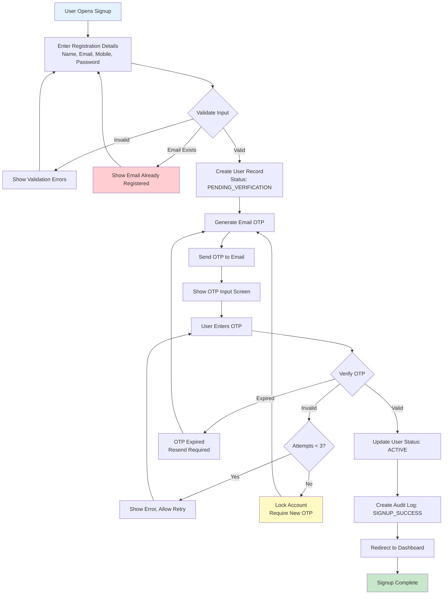
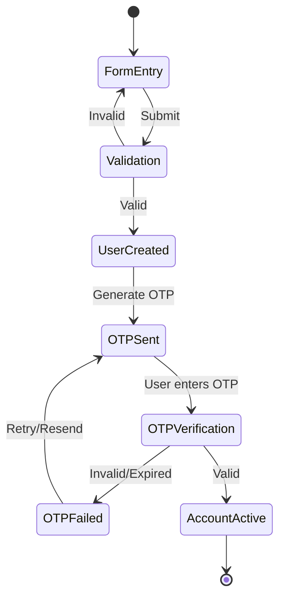
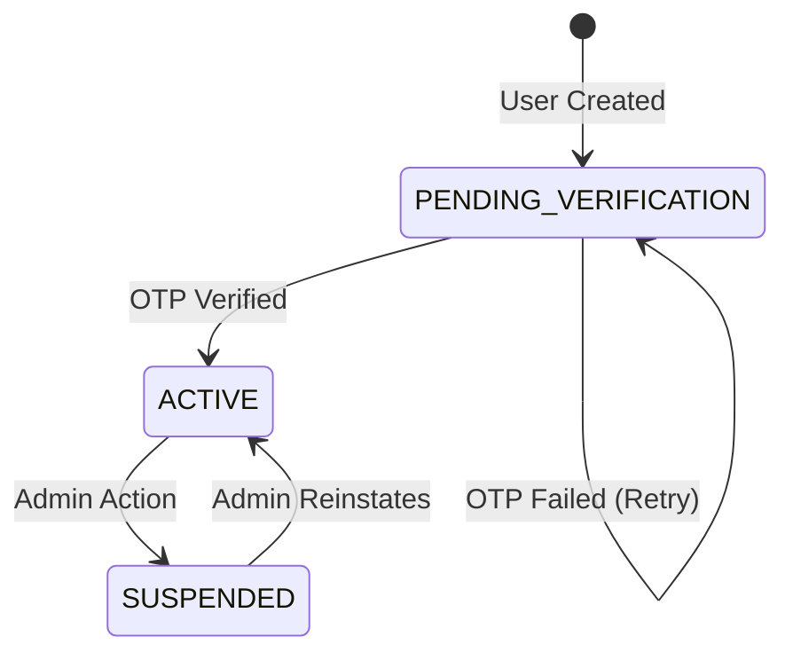

# User Signup Workflow

Create verified user accounts for Buyers and Sellers using email OTP verification.

---

## Flow Diagram

---

## State Diagram

---

## User Status States

---

## State Transitions

| Entity | From | To | Trigger |
|--------|------|-----|---------|
| users | - | PENDING_VERIFICATION | Form submitted |
| users | PENDING_VERIFICATION | ACTIVE | OTP verified |
| email_otp_verifications | - | PENDING | OTP generated |
| email_otp_verifications | PENDING | VERIFIED | OTP matched |
| email_otp_verifications | PENDING | EXPIRED | Timeout |
| audit_logs | - | SIGNUP_INITIATED | Form submitted |
| audit_logs | - | SIGNUP_SUCCESS | OTP verified |

---

## Key Points

- Single registration for both Buyer and Seller
- Role is inferred by actions (list property = Seller, make offer = Buyer)
- Email OTP only (no SMS to minimize cost)
- Maximum 3 OTP attempts before lockout
- OTP expires after 10 minutes
- Lockout duration: 30 minutes (automatic unlock)

---

## Security Rules

- Each OTP can only be used ONCE (single-use enforcement)
- Subsequent attempts with same OTP are rejected even if not expired
- Email cannot be changed until account is verified (status=ACTIVE)
- Password must be minimum 8 characters with 1 letter and 1 number
