# Buyer Offer Flow Workflow

Submit, negotiate, and finalize offers with controlled, traceable negotiation.

---

## Flow Diagram

---

## State Diagram

---

## Counter Offer Flow

---

## State Transitions

| Entity | From | To | Trigger |
|--------|------|-----|---------|
| offers | - | PENDING | Buyer submits |
| offers | PENDING | ACCEPTED | Seller accepts |
| offers | PENDING | REJECTED | Seller rejects |
| offers | PENDING | COUNTERED | Seller counters |
| offers | PENDING | EXPIRED | Timer expires |
| offers | COUNTERED | ACCEPTED | Buyer accepts counter |
| offers | COUNTERED | REJECTED | Buyer rejects counter |
| audit_logs | - | OFFER_SUBMITTED | Offer created |
| audit_logs | - | OFFER_ACCEPTED | Acceptance |
| audit_logs | - | OFFER_COUNTERED | Counter made |

---

## Concurrency Rules

```mermaid
flowchart TD
    A[Property ACTIVE] --> B{Multiple Offers?}
    B -->|Yes| C[All Offers Visible to Seller]
    C --> D[Seller Accepts ONE]
    D --> E[Other Offers Auto-REJECTED]
    E --> F[Property → RESERVED]
```

---

## Key Points

- Multiple buyers can make offers simultaneously
- Only ONE offer can be accepted
- When one is accepted, others auto-reject
- All offers are time-bound (default 48h)
- Counter offers restart the timer
- Immutable offer history for disputes
