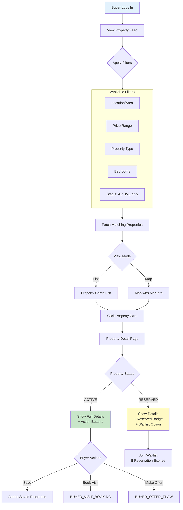
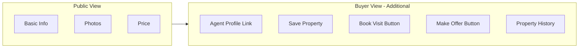

# Buyer Property Discovery Workflow

Authenticated buyers browse and search for properties with enhanced visibility.

---

## Flow Diagram

---

## Buyer vs Public Visibility

---

## State Transitions

| Entity | From | To | Trigger |
|--------|------|-----|---------|
| properties | ACTIVE | ACTIVE | View only (no change) |

---

## Key Points

- Buyers see same fields as public plus action buttons
- Exact address still hidden until visit approved
- Saved properties persist across sessions
- Filters are applied server-side
- RESERVED properties show remaining time
