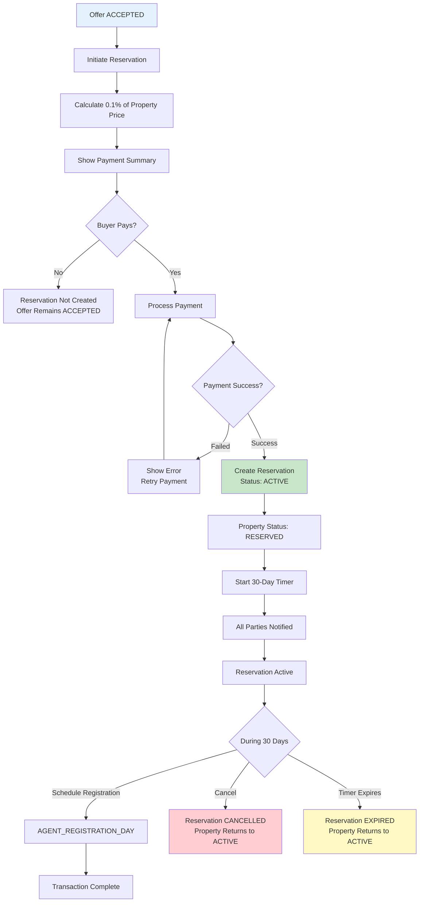
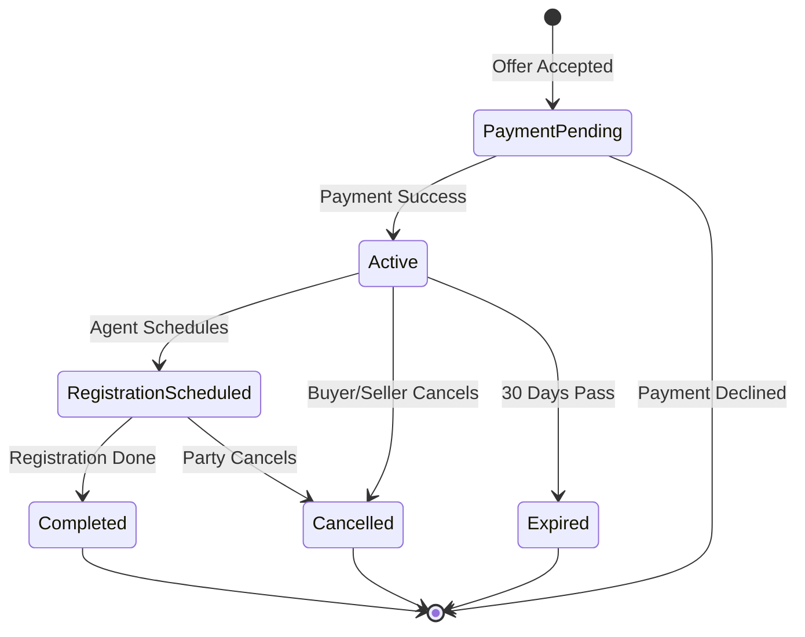
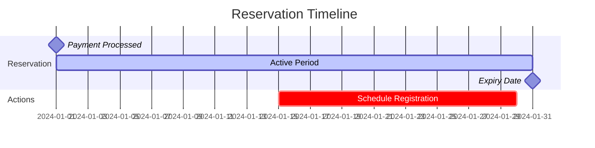
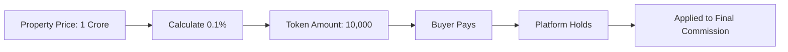

# Buyer Reservation Workflow

Secure property with 0.1% token payment and 30-day reservation period.

---

## Flow Diagram

---

## State Diagram

---

## Timeline

---

## Payment Flow

---

## State Transitions

| Entity | From | To | Trigger |
|--------|------|-----|---------|
| reservations | - | ACTIVE | Payment success |
| reservations | ACTIVE | EXPIRED | 30 days pass |
| reservations | ACTIVE | CANCELLED | Cancellation |
| properties | ACTIVE | RESERVED | Reservation created |
| properties | RESERVED | ACTIVE | Reservation expires/cancels |
| properties | RESERVED | SOLD | Registration complete |
| payment_logs | - | COMPLETED | Payment processed |
| audit_logs | - | RESERVATION_CREATED | Payment success |
| audit_logs | - | RESERVATION_EXPIRED | Timer expires |

---

## Key Points

- Token is 0.1% of agreed price
- Reservation locks property for 30 days
- Registration MUST happen within 30 days
- Token is non-refundable if buyer cancels
- Token refundable if seller cancels
- Expiry handled by SYSTEM_RESERVATION_EXPIRY workflow
