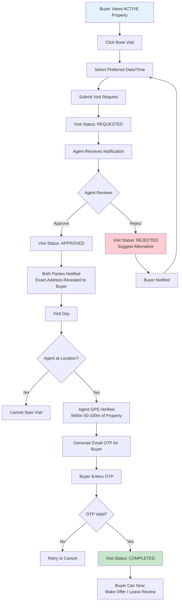
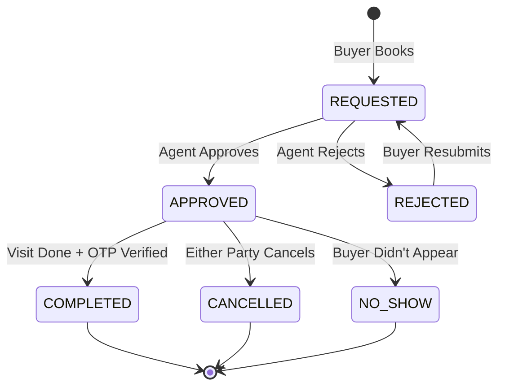
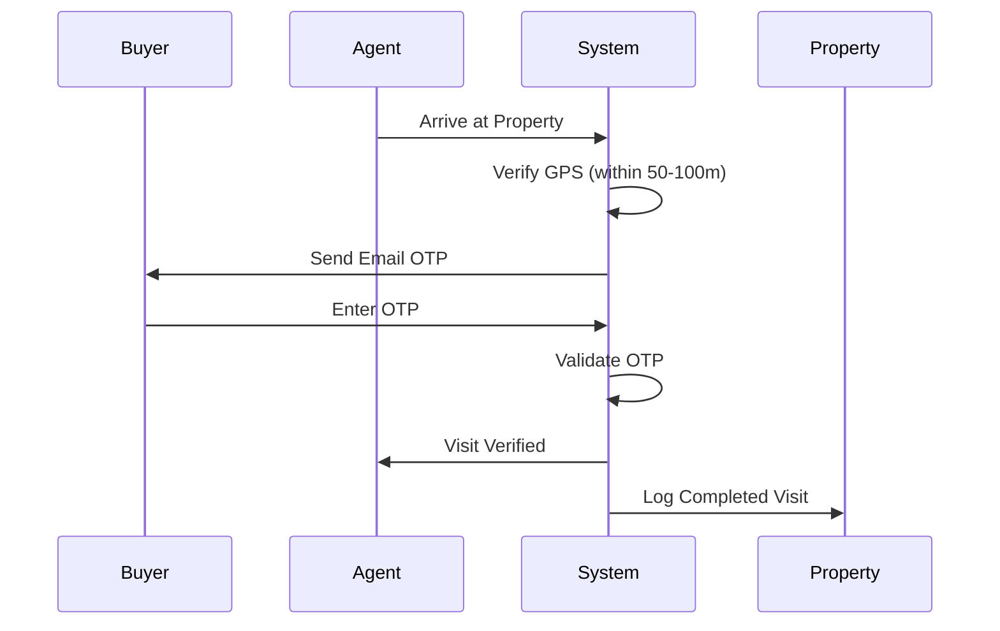

# Buyer Visit Booking Workflow

Request, schedule, and verify property visits with agent involvement.

---

## Flow Diagram

---

## State Diagram

---

## Visit Verification Flow

---

## State Transitions

| Entity | From | To | Trigger |
|--------|------|-----|---------|
| visit_requests | - | REQUESTED | Buyer submits |
| visit_requests | REQUESTED | APPROVED | Agent approves |
| visit_requests | REQUESTED | REJECTED | Agent rejects |
| visit_requests | APPROVED | COMPLETED | OTP verified |
| visit_requests | APPROVED | CANCELLED | Cancellation |
| visit_requests | APPROVED | NO_SHOW | Buyer absent |
| audit_logs | - | VISIT_REQUESTED | Request created |
| audit_logs | - | VISIT_APPROVED | Agent approves |
| audit_logs | - | VISIT_COMPLETED | Visit done |

---

## Trust & Security

- Exact address revealed ONLY after visit approved
- Agent must be physically present (GPS verified)
- Buyer must verify presence with OTP
- All actions logged immutably
- NO_SHOW affects buyer trust score
