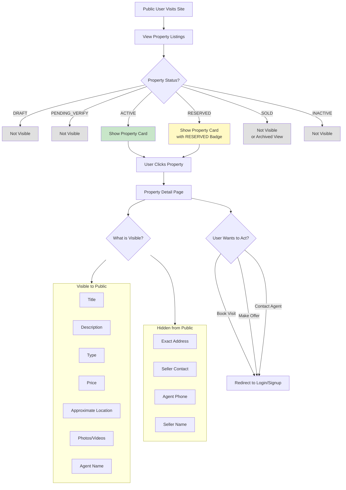
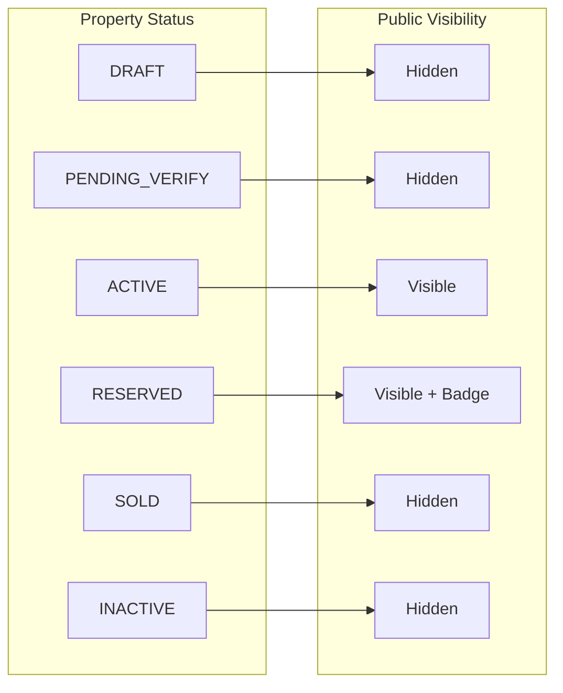

# Public Property View Workflow

Control what unauthenticated users can see when browsing properties.

---

## Flow Diagram

---

## Visibility Rules

---

## Field Visibility Matrix

| Field | Public | Registered User | After Visit Approved |
|-------|--------|-----------------|---------------------|
| Title | Yes | Yes | Yes |
| Description | Yes | Yes | Yes |
| Price | Yes | Yes | Yes |
| Photos | Yes | Yes | Yes |
| Approximate Area | Yes | Yes | Yes |
| Exact Address | No | No | Yes |
| Seller Name | No | No | No |
| Seller Phone | No | No | No |
| Agent Name | Yes | Yes | Yes |
| Agent Phone | No | No | Yes |

---

## State Transitions

| Entity | From | To | Trigger |
|--------|------|-----|---------|
| properties | ACTIVE | ACTIVE | View only (no change) |
| properties | RESERVED | RESERVED | View only (no change) |

---

## Key Points

- Public users see only ACTIVE and RESERVED properties
- RESERVED properties show countdown timer
- Exact address is NEVER shown to unauthenticated users
- Contact information requires login
- All action buttons redirect to login/signup
- SEO-friendly property cards with public data only
