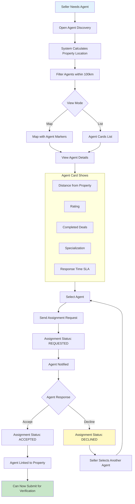
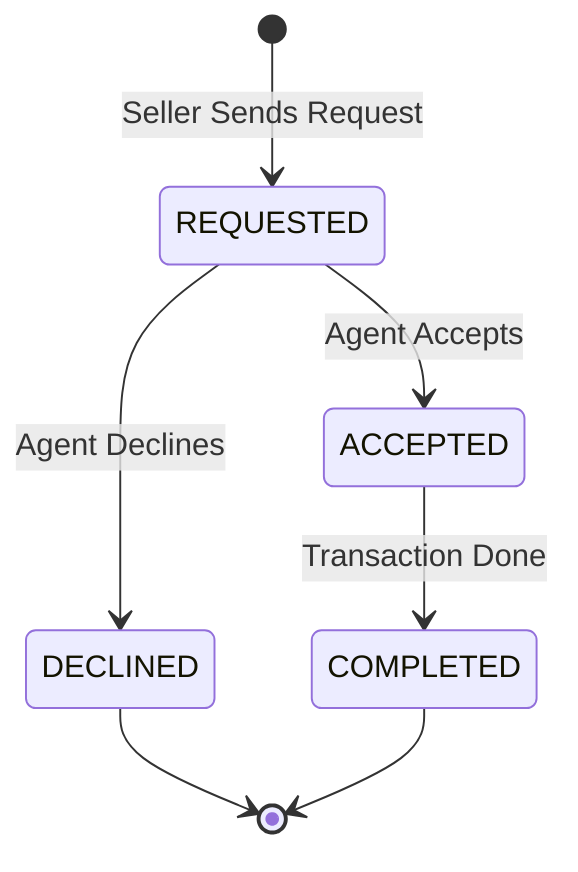
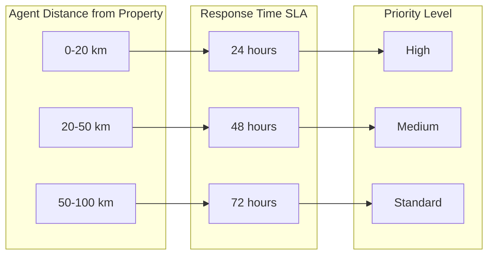

# Seller Hire Agent Workflow

Discover and assign platform-verified agents within service radius.

---

## Flow Diagram

---

## State Diagram

---

## Distance-Based SLA

---

## State Transitions

| Entity | From | To | Trigger |
|--------|------|-----|---------|
| agent_assignments | - | REQUESTED | Seller sends request |
| agent_assignments | REQUESTED | ACCEPTED | Agent accepts |
| agent_assignments | REQUESTED | DECLINED | Agent declines |
| agent_assignments | ACCEPTED | COMPLETED | Transaction complete |
| audit_logs | - | AGENT_REQUESTED | Request sent |
| audit_logs | - | AGENT_ACCEPTED | Agent accepts |
| audit_logs | - | AGENT_DECLINED | Agent declines |

---

## Key Points

- Only ACTIVE agents within 100km shown
- Agent radius is from their base location
- SLA based on distance ensures fair expectations
- Agents can decline without penalty
- Seller can only have ONE active agent per property
