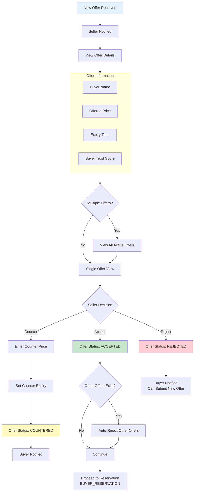
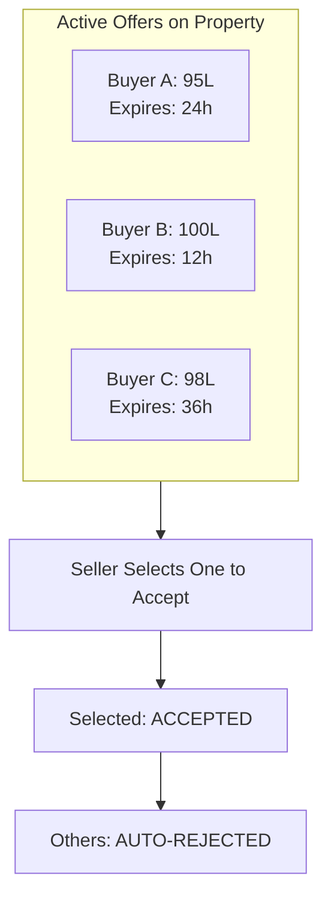
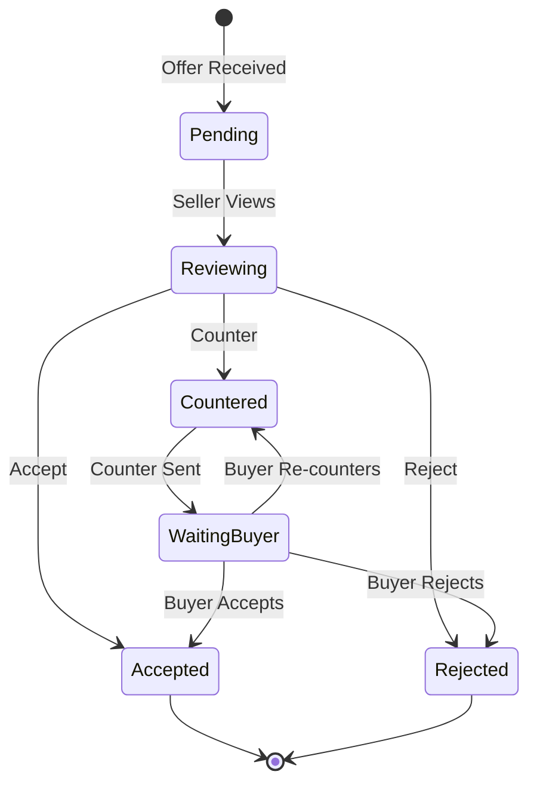

# Seller Offer Handling Workflow

Review, respond, and negotiate offers on listed properties.

---

## Flow Diagram

---

## Multiple Offers View

---

## State Diagram

---

## State Transitions

| Entity | From | To | Trigger |
|--------|------|-----|---------|
| offers | PENDING | ACCEPTED | Seller accepts |
| offers | PENDING | REJECTED | Seller rejects |
| offers | PENDING | COUNTERED | Seller counters |
| offers | COUNTERED | ACCEPTED | Buyer accepts counter |
| offers | PENDING | REJECTED | Auto-reject (another accepted) |
| audit_logs | - | OFFER_ACCEPTED | Acceptance |
| audit_logs | - | OFFER_REJECTED | Rejection |
| audit_logs | - | OFFER_COUNTERED | Counter sent |

---

## Key Points

- Seller sees all active offers in one view
- Accepting one offer auto-rejects all others
- Counter offers have new expiry timers
- Agent can also respond on seller's behalf
- All negotiations are logged and immutable
