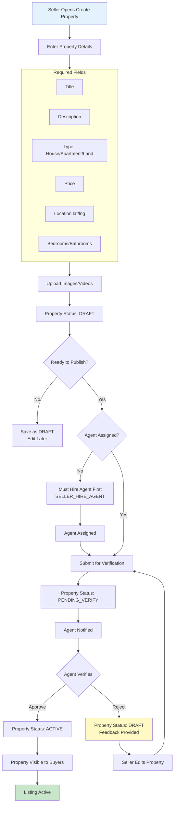
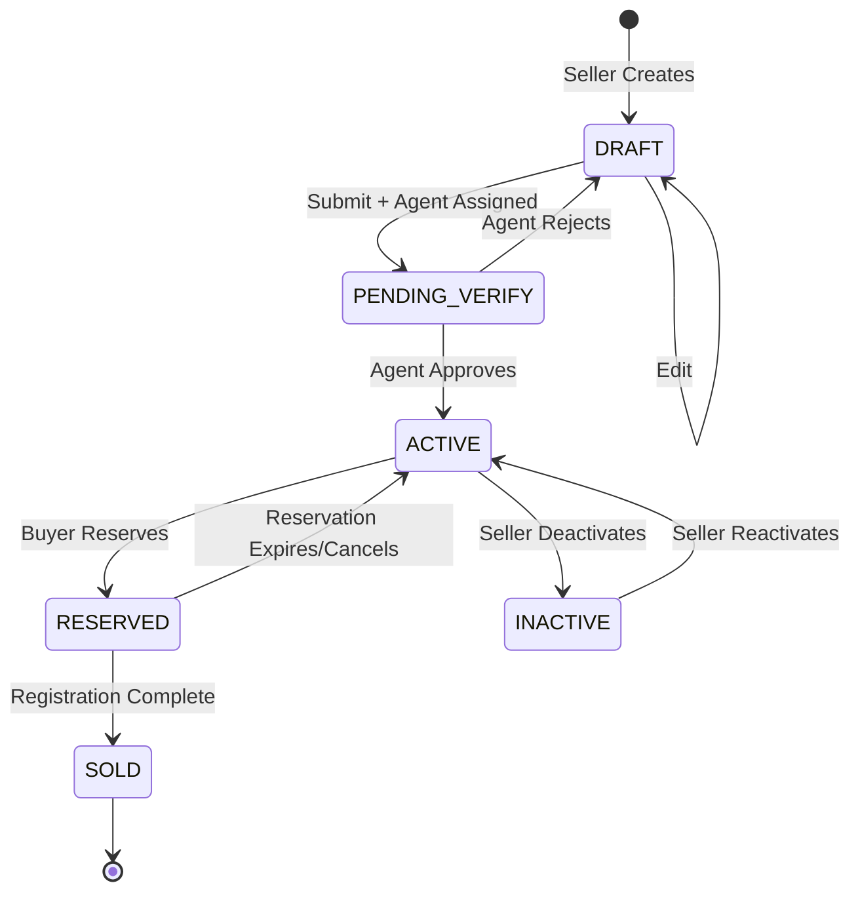
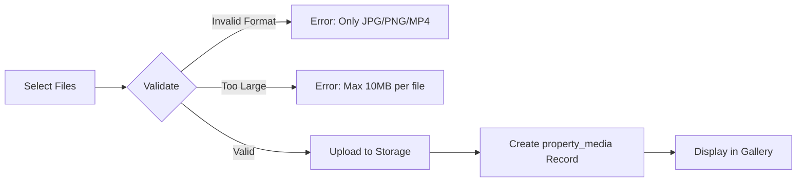

# Seller Property Listing Workflow

Create, manage, and publish properties through agent verification.

---

## Flow Diagram

---

## State Diagram

---

## Media Upload Flow

---

## State Transitions

| Entity | From | To | Trigger |
|--------|------|-----|---------|
| properties | - | DRAFT | Seller creates |
| properties | DRAFT | PENDING_VERIFY | Submit for verification |
| properties | PENDING_VERIFY | ACTIVE | Agent approves |
| properties | PENDING_VERIFY | DRAFT | Agent rejects |
| properties | ACTIVE | INACTIVE | Seller deactivates |
| properties | INACTIVE | ACTIVE | Seller reactivates |
| property_media | - | CREATED | File uploaded |
| audit_logs | - | PROPERTY_CREATED | Initial creation |
| audit_logs | - | PROPERTY_SUBMITTED | Submit for verify |
| audit_logs | - | PROPERTY_VERIFIED | Agent approval |

---

## Key Points

- Property cannot go ACTIVE without agent verification
- Agent must be assigned before submission
- Rejected properties return to DRAFT with feedback
- Seller can edit DRAFT properties freely
- ACTIVE properties have limited editable fields
