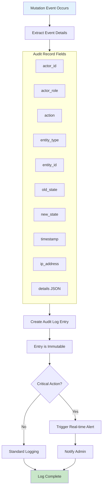
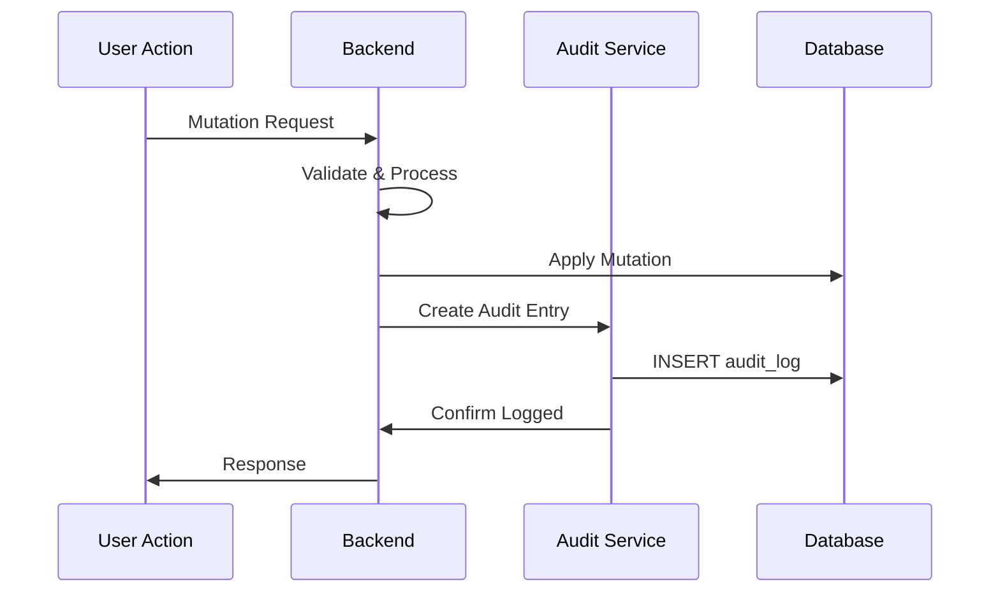
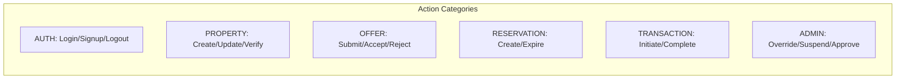

# System Audit Logging Workflow

Create immutable audit records for all platform mutations.

---

## Flow Diagram

---

## Audit Entry Sequence

---

## Audit Record Categories

---

## State Transitions

| Entity | From | To | Trigger |
|--------|------|-----|---------|
| audit_logs | - | CREATED | Any mutation |

---

## Key Points

- Triggered by ALL mutations
- Records are immutable
- Cannot be updated or deleted
- Includes before/after state
- IP address logged for security
- Critical actions trigger alerts
