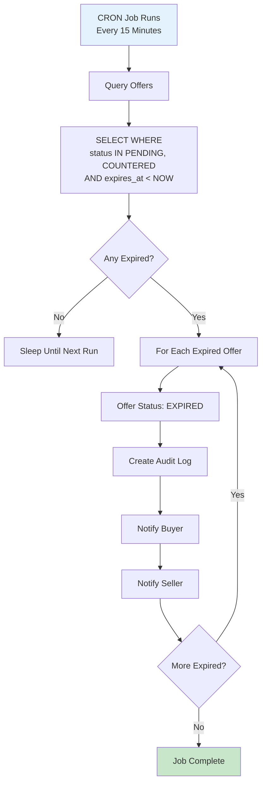

# System Offer Expiry Workflow

Automatically expire offers that exceed their time limit.

---

## Flow Diagram

---

## State Transitions

| Entity | From | To | Trigger |
|--------|------|-----|---------|
| offers | PENDING | EXPIRED | Timer runs out |
| offers | COUNTERED | EXPIRED | Timer runs out |
| audit_logs | - | OFFER_EXPIRED | System action |

---

## Key Points

- Runs every 15 minutes
- Default offer expiry: 48 hours
- Counter offers have separate expiry
- Expired offers cannot be revived
- Buyer must submit new offer
