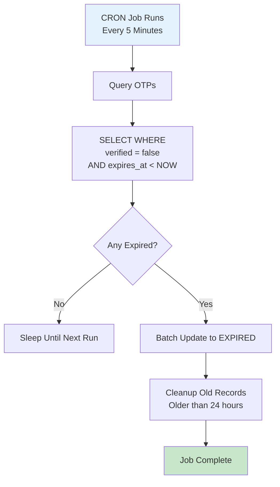

# System OTP Expiry Workflow

Automatically expire OTPs that exceed their validity period.

---

## Flow Diagram

---

## State Transitions

| Entity | From | To | Trigger |
|--------|------|-----|---------|
| email_otp_verifications | PENDING | EXPIRED | 10 minutes pass |

---

## Key Points

- Runs every 5 minutes
- OTP validity: 10 minutes
- Records cleaned after 24 hours
- No notification on expiry
- User must request new OTP
