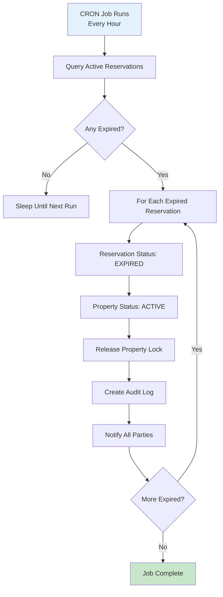
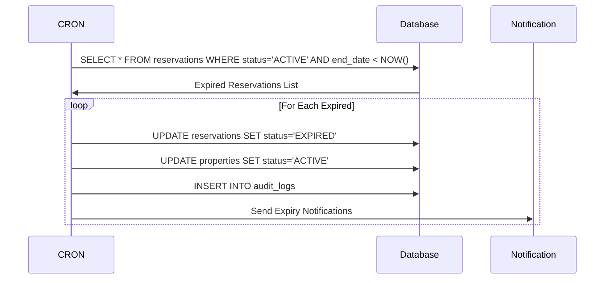

# System Reservation Expiry Workflow

Automatically expire reservations that exceed 30-day limit.

---

## Flow Diagram

---

## Expiry Check Logic

---

## State Transitions

| Entity | From | To | Trigger |
|--------|------|-----|---------|
| reservations | ACTIVE | EXPIRED | Timer exceeds 30 days |
| properties | RESERVED | ACTIVE | Reservation expires |
| audit_logs | - | RESERVATION_EXPIRED | System action |

---

## Key Points

- Runs every hour (0 * * * *)
- Checks all ACTIVE reservations
- 30-day limit is non-negotiable
- Property returns to open market
- All parties notified of expiry
- Token payment handling per policy
